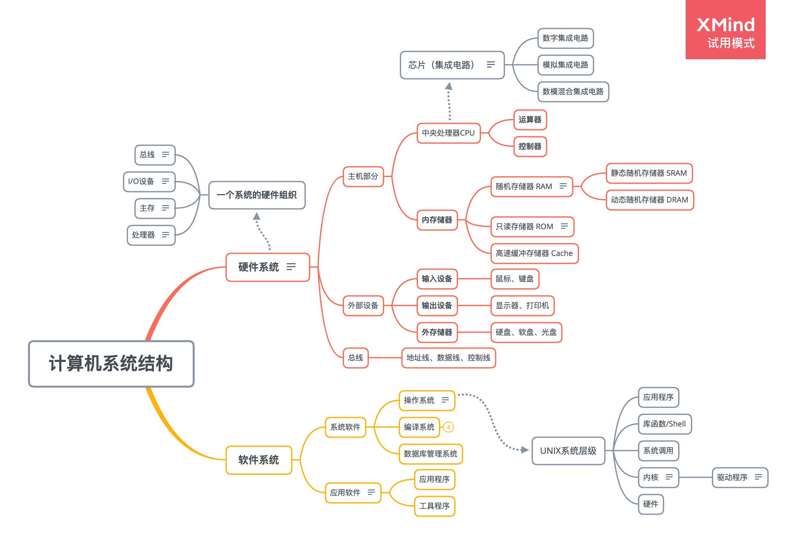

# 一、Linux介绍

## 计算机系统



- **硬件系统**：运算器、控制器、存储器、输入设备、输出设备

  - **中央处理单元**：CPU，简称处理器，是解释或执行存储在主存中指令的引擎。处理器的核心是一个字长的存储设备（或寄存器），称为程序计数器（PC）。在任何时刻，PC 都指向主存中的某条机器语言指令（即含有该条指令的地址）。CPU 在指令的要求下，可能会进行以下操作：加载、存储、操作、跳转。
  - **主存**：一个临时存储设备，在处理器执行程序时，用来存放程序和程序处理的数据。从物理上来说，主存是由一组动态随机存取存储器（DRAM）芯片封装组成。从逻辑上来说，存储器是一个线性的字节数组，每个字节都有唯一的地址（即数组索引），这些地址是从 0 开始的。
  - **I/O设备**：系统与外部世界的联系通道。
  - **总线**：一组贯穿整个系统的电子管，携带信息字节并负责在各个部件间传递。通常总线被设计成传送定长的字节块，也就是字（word），现在大多数机器字长（字中的字节数）有的是 4 个字节，有的是 8 个字节。
  
- **操作系统**：管理计算机硬件的程序，在用户和硬件之间起媒介作用的一种程序。操作系统的一个功能是提供抽象的接口，另外一个主要功能是管理硬件资源（CPU、存储器、I/O设备）。操作系统通过几个基本抽象概念实现以上功能：**文件**是对I/O设备的抽象表示；**虚拟内存**是对主存和磁盘I/O的抽象表示；**进程**是对处理器、主存和I/O设备的抽象表示。

## Linux内核

在正确的情况下，内核对于用户是不可见的，它在自己的小世界（称为内核空间）中工作，并从中分配内存和跟踪所有内容的存储位置。用户所看到的内容（例如 Web 浏览器和文件）则被称为用户空间，这些应用通过系统调用接口（SCI）与内核进行交互。


1. 内存管理
2. 进程管理
3. 设备驱动程序
4. 系统调用和安全防护

## Linux目录

- bin：binaries，存放二进制可执行文件
- sbin：super user binaries，存放二进制可执行文件，只有root才能访问
- etc ：etcetera，存放系统配置文件
- usr：unix shared resources，用于存放共享的系统资源
- home：存放用户文件的根目录
- root：超级用户目录
- dev ：devices，用于存放设备文件
- lib ：library，存放跟文件系统中的程序运行所需要的共享库及内核模块
- mnt：mount，系统管理员安装临时文件系统的安装点
- boot：存放用于系统引导时使用的各种文件
- tmp：temporary，用于存放各种临时文件
- var：variable，用于存放运行时需要改变数据的文件


# 二、Linux命令

| [Linux命令大全](https://man.linuxde.net/) | 示例                                                         |
| ----------------------------------------- | ------------------------------------------------------------ |
| grep<br />搜索数据                        | grep -n xxx file 【显示行号】<br />grep -r xxx path 【递归查找目录文件】<br />grep -v xxx file 【反向搜索，输出不匹配的行】<br />grep -w xxx file 【显示全词匹配的行】<br />grep -c xxx file 【显示匹配的行数】<br />grep -l xxx * 【显示匹配的文件名】 <br />grep -A 2 xxx file 【显示匹配内容和后2行】<br />grep -B 2 xxx file 【显示匹配内容和前2行】<br />grep -C 2 xxx file 【显示匹配内容和前后2行】<br />grep -e xxx -e yyy file, grep -E 'xxx\|yyy' file, egrep 'xxx\|yyy' file 【或匹配】 <br />grep '2020-08-3[0-9]' file |
| find<br />递归查找文件                    | find [path] -name file<br />find [path] -type f -name file 【f 普通文件，d 目录】<br />find . -type f -name file -exec printf "File: %s\n" {} \; |
| xargs<br />配合管道｜使用                 | find . -name "1.txt" \| xargs ls 【与管道配合使用，将标准输出转化为参数】 |
| tar<br />归档                             | tar -xzvf xxx.tar.gz -C path 【解压缩文件】<br />tar -czvf xxx.tar.gz file 【打包压缩文件】 |
| zip/unzip<br />压缩/解压zip文件           | zip -r xxx.zip ./*<br />unzip -d /home xxx.zip               |
| gzip/gunzip<br />压缩/解压gz文件          | gzip -c -r xxx >xxx.gz<br />gunzip -c xxx.gz >xxx            |
| ln<br />创建链接文件                      | ln -snf file ln_file                                         |
| netstat<br />查看网络端口                 | netstat -anp ｜ grep port                                    |
| ldd<br />查看程序/库依赖的共享库          | ldd -r xxx.so 【-r选项，数据对象和函数的重定位】             |
| readelf<br />查看elf目标文件信息          | readelf -sD xxx.so 【查看elf文件的动态符号表】               |
| nm<br />查看目标文件的符号表              | nm file                                                      |
| objdump<br />查看目标文件的构成           | objdump file                                                 |
| su/sudo<br />切换用户                     | su user 【切换用户，默认切换到root用户】<br />su - 【切换为root用户】<br />sudo 【跳过root用户执行命令，通过配置/etc/sudoers，设置提权用户】 |
| chmod/chown<br />修改文件权限             | drwxr-x--- 1 va ivs 4096 Dec 16 04:10 VA2<br/>d : 目录<br/>rwx : 文件属主权限(va)<br/>r-x : 属组成员权限(ivs)<br/>--- : 其他用户权限 |
| top<br />查看系统实时进程情况             | top -H -p 1234                                               |
| mount/umount<br />挂载存储媒体            | mount -t type device directory<br />umount device            |
| df<br />查看挂载设备磁盘使用              | df -h                                                        |
| du<br />查看目录的硬盘使用                | du -ch path<br />du -sh *                                    |
| 文件查看                                  | cat -n file 【按行号查看文件】<br />tail -f file 【循环显示文件末尾内容】<br />tail -n 10 file 【显示文件末尾10行内容】<br />head -n 10 file 【显示文件头部10行内容】<br />more file 【按页查看文件内容，适合大文件】<br />less file 【与more类似，多了个向前翻页的功能】 |

## vim


## sed

sed是一个的文件处理工具，本身是一个管道命令，主要是以行为单位进行处理，可以对数据行进行替换、删除、新增、选取等操作。

- echo this is xxx | sed 's/xxx/yyy/'
- sed 's/xxx/yyy/' file 【替换文本中的字符串】
- sed 's/xxx/yyy/g' file 【/g 替换每一行中的所有匹配】
- sed -n 's/xxx/yyy/p' file 【-n选项和p命令一起使用，只打印那些发生替换的行】
- sed -e 's/brown/green/; s/dog/cat/' file 【-e选项，同一行里执行多条命令】
- sed -f script.sed file
- sed -n '/2020-08-30-15-38-[0-9]/,/2020-08-30-15-50-[0-9]/p' file 【,选项，选定行范围】

## awk

awk是一个强大的文本分析工具，相对于grep查找，sed编辑，awk在其对数据分析并生成报告时，更为强大。简单来说awk就是把文件逐行的读入，以空格为默认分隔符将每行切片，切开部分再进行各种分析处理。

- awk 'BEGIN{ commands } pattern{ commands } END{ commands }'
  执行`BEGIN{ commands }`语句；从文件或标准输入逐行读取，执行`pattern{ commands }`语句；执行`END{ commands }`语句
  
- echo -e "A line 1\nA line 2" | awk 'BEGIN{ print "Start" } { print; print $1 } END{ print "End" }'
  `$0`整行内容；`$n`第n个字段；`NF`字段数
  
- awk -F: '{print $1}' data.txt 【-F指定分隔符: 】


# 三、进程&线程

进程是程序执行时的一个实例，即它是程序已经执行到何种程度的数据结构的汇集。从内核的观点看，进程的目的就是担当分配系统资源（CPU时间、内存等）的基本单位。

线程是进程的一个执行流，是CPU调度和分派的基本单位，它是比进程更小的能独立运行的基本单位。一个进程由几个线程组成（拥有很多相对独立的执行流的用户程序共享应用程序的大部分数据结构），线程与同属一个进程的其他的线程共享进程所拥有的全部资源。

进程有独立的地址空间，一个进程崩溃后，在保护模式下不会对其它进程产生影响，而线程只是一个进程中的不同执行路径。线程有自己的堆栈和局部变量，但线程没有单独的地址空间，一个线程死掉就等于整个进程死掉，所以多进程的程序要比多线程的程序健壮，但在进程切换时，耗费资源较大，效率要差一些。但对于一些要求同时进行并且又要共享某些变量的并发操作，只能用线程，不能用进程。

> "进程是资源分配的最小单位，线程是程序执行的最小单位"


## [进程](https://github.com/CyC2018/CS-Notes/blob/master/notes/计算机操作系统%20-%20进程管理.md)

正常情况下，子进程是通过父进程创建的，子进程的结束和父进程的运行是一个异步过程，即父进程永远无法预测子进程到底什么时候结束。 当一个进程完成它的工作终止之后，它的父进程需要调用wait()或者waitpid()系统调用取得子进程的终止状态。

```c
1、fork/vfork // 创建子进程
2、exec族函数 // 将当前进程替换为新进程
3、wait/waitpid // 等待获取子进程状态的改变
4、exit // 终止进程

#include <stdio.h>
#include <stdlib.h>
#include <unistd.h>
#include <sys/types.h>
#include <sys/wait.h>
int main(int argc, char *argv[]) {
    pid_t pid;
    pid = fork();
    if (pid < 0) {
        perror("fork failed");
        exit(1);
    } else if (pid == 0) {
        printf("This is in child progress\n");
        char *const argv[] = {"exec_call", NULL};
        execv("./exec_call", argv);	// 执行exec_call新程序
    } else {
        printf("This is in parent progress\n");
        int stat_val;
        waitpid(pid, &stat_val, 0);
        if (WIFEXITED(stat_val)) {
            printf("Child exited with code %d\n", WEXITSTATUS(stat_val));		
        }
    }
    return 0;
}
```

### 进程状态


| 状态 | 说明                                                         |
| ---- | ------------------------------------------------------------ |
| R    | running or runnable (on run queue) 正在执行或者可执行，此时进程位于执行队列中。 |
| D    | uninterruptible sleep (usually I/O) 不可中断阻塞，通常为 IO 阻塞。 |
| S    | interruptible sleep (waiting for an event to complete) 可中断阻塞，此时进程正在等待某个事件完成。 |
| Z    | zombie (terminated but not reaped by its parent) 僵死，进程已经终止但是尚未被其父进程获取信息。 |
| T    | stopped (either by a job control signal or because it is being traced) 结束，进程既可以被作业控制信号结束，也可能是正在被追踪。 |

### 孤儿进程

一个父进程退出，而它的一个或多个子进程还在运行，那么那些子进程将成为孤儿进程。孤儿进程将被init进程所收养，并由init进程对它们完成状态收集工作。由于孤儿进程会被init进程给收养，所以孤儿进程不会对系统造成危害。

### 僵尸进程

一个进程使用fork创建子进程，如果子进程退出，而父进程并没有调用wait或waitpid获取子进程的状态信息，那么子进程的进程描述符仍然保存在系统中，这种进程称之为僵尸进程。如果要消灭系统中大量的僵尸进程，只需要将其父进程杀死，此时所有的僵尸进程就会编程孤儿进程，从而被init所收养，这样init就会释放所有的僵尸进程所占有的资源，从而结束僵尸进程。

在每个进程退出的时候，内核释放该进程所有的资源，包括打开的文件，占用的内存等。 但是仍然为其保留一定的信息（进程号、退出状态、运行时间t等），直到父进程通过wait/waitpid来取时才释放。 如果进程不调用wait/waitpid的话， 那么保留的那段信息就不会释放，其进程号就会一直被占用，但是系统所能使用的进程号是有限的，如果大量的产生僵尸进程，将因为没有可用的进程号而导致系统不能产生新的进程，此即为僵尸进程的危害，应当避免。

### 守护进程

一个守护进程的父进程是init进程，因为它真正的父进程在fork出子进程后就先于子进程exit退出了，所以它是一个由init继承的孤儿进程。

Linux Daemon（守护进程）是运行在后台的一种特殊进程。它独立于控制终端并且周期性地执行某种任务或等待处理某些发生的事件。Linux系统的大多数服务器就是通过守护进程实现的。常见的守护进程包括系统日志进程syslogd、 web服务器httpd、邮件服务器sendmail和数据库服务器mysqld等。守护进程一般在系统启动时开始运行，除非强行终止，否则直到系统关机都保持运行。守护进程经常以超级用户（root）权限运行，因为它们要使用特殊的端口（1-1024）或访问某些特殊的资源。

> [Daemon.cpp](CODECPP/System/Daemon.cpp)

### 进程间通信

进程之间的通信方式：管道（PIPE）、信号量（Semaphore）、信号（Signal）、消息队列（Message Queue）、共享内存（Shared Memory）、套接字（Socket）


## 线程

```c
1、int pthread_create(pthread_t *thread, const pthread_attr_t *attr, void *(*start_routine) (void *), void *arg); // 创建一个线程。thread：线程标识符的指针，attr：线程属性，start_routine：线程运行函数地址，arg：运行函数入参
2、int pthread_join(pthread_t tid, void **status); // 等待某个线程退出
3、pthread_t pthread_self(void); // 返回当前线程的ID
4、int pthread_detach(pthread_t tid); // 指定线程变为分离状态。变为分离状态的线程，如果线程退出，它的所有资源将全部释放；而不是分离状态，线程必须保留它的线程ID、退出状态，直到其它线程对它调用了pthread_join。
5、void pthread_exit(void *status); // 终止线程
```

**资源消耗**：多个线程之间使用相同的地址空间，共享大部分数据，启动一个线程所花费的空间远远小于启动一个进程所花费的空间，线程间彼此切换所需的时间也远远小于进程间切换所需要的时间。

**通信机制**：线程之间共享数据空间，所以一个线程的数据可以直接为其它线程所用，快捷且方便。

**线程互斥&同步**：一个线程在访问资源未结束时，其他线程不能访问资源。在多线程编程时，要解决数据访问的互斥与同步，最常见的方法是加锁。

### 信号量
一个特殊类型的变量

```c
// 二元信号量：一个线程独占访问的资源。
// 多元信号量：一个初始值为N的信号量允许被N个线程并发访问。
int sem_init(sem_t *sem, int pshared, unsigned int value);
int sem_wait(sem_t *sem);	// 阻塞等待信号量，当信号量值大于0时，信号量减1，向下执行。
int sem_trywait(sem_t *sem);
int sem_post(sem_t *sem);	// 释放信号量，信号量值加1。
int sem_getvalue(sem_t *sem, int *sval);
int sem_destroy(sem_t *sem);
```

### 互斥锁

与二元信号量很相似，区别是互斥锁由哪个线程获取，哪个线程就负责释放。

```c
int pthread_mutex_init(pthread_mutex_t *mutex, const pthread_mutex_attr_t *mutexattr);
int pthread_mutex_lock(pthread_mutex_t *mutex);
int pthread_mutex_trylock(pthread_mutex_t *mutex);
int pthread_mutex_timedlock(pthread_mutex_t * mutex,const struct timespec *tsptr);
int pthread_mutex_unlock(pthread_mutex_t *mutex);
int pthread_mutex_destroy(pthread_mutex_t *mutex);
```

### 读写锁

读写锁有三种状态：自由、共享、独占。

```c
// 自由状态下（无读者写者），能以共享/独占方式获取（被读/被写）。
// 共享状态下（被读），能以共享方式再被获取（被读）。 
// 独占状态下（被写），不能被获取。
int pthread_rwlock_init(pthread_rwlock_t *rwlock, const pthread_rwlockattr_t *attr);
int pthread_rwlock_rdlock(pthread_rwlock_t *rwlock);
int pthread_rwlock_wrlock(pthread_rwlock_t *rwlock);
int pthread_rwlock_timedrdlock(pthread_rwlock_t * rwlock, const struct timespec *abstime);
int pthread_rwlock_timedwrlock(pthread_rwlock_t * rwlock, const struct timespec *abstime);
int pthread_rwlock_tryrdlock(pthread_rwlock_t *rwlock);
int pthread_rwlock_trywrlock(pthread_rwlock_t *rwlock);
int pthread_rwlock_unlock(pthread_rwlock_t *rwlock);
int pthread_rwlock_destroy(pthread_rwlock_t *rwlock);
```

### 递归锁

递归锁也叫可重入锁，同一个线程可以多次获取同一个递归锁，不会产生死锁。递归锁是不提倡的，用到递归锁说明代码设计有问题，可能会隐藏某些问题。

```c
int pthread_mutexattr_settype(pthread_mutexattr_t *attr, int type);

pthread_mutexattr_t attr;
pthread_mutexattr_init(&attr);
pthread_mutexattr_settype(&attr, PTHREAD_MUTEX_RECURSIVE);
pthread_mutex_t Mutex;
pthread_mutex_init(&Mutex, &attr);
```

### 条件变量

阻塞线程，避免线程不断轮训，类似于一个栅栏。一个条件变量可以被多个线程等待，当条件变量被唤醒，所有的线程可以一起恢复执行。

> [Condition.cpp](CODECPP/System/Condition.cpp)

```c
int pthread_cond_init(pthread_cond_t *cond, pthread_condattr_t *cond_attr);
int pthread_cond_wait(pthread_cond_t *cond, pthread_mutex_t *mutex);
int pthread_cond_timewait(pthread_cond_t *cond, pthread_mutex *mutex, const timespec *abstime);
int pthread_cond_signal(pthread_cond_t *cond);
int pthread_cond_broadcast(pthread_cond_t *cond);
int pthread_cond_destroy(pthread_cond_t *cond);
```

### 死锁

死锁指的是，两个以上线程在执行过程中，因争夺资源而造成一种互相等待的现象，若无外部处理，将会无限等待下去。死锁本质上就是一个线程在请求锁的时候，永远也请求不到。死锁的危险始终存在，应该在程序编写的时候尽量减少死锁存在的范围。

- 死锁发生的情况： 1、忘记释放锁；2、单线程重复申请锁；3、多线程申请多把锁，造成相互等待。
- [死锁问题排查](http://senlinzhan.github.io/2018/01/01/gdb-on-multithreaded/)：通过gdb pstack命令可查看进程的栈跟踪，多次对比线程堆栈，查看哪些线程一直处于等锁状态，进一步查看栈帧相关变量，结合代码推断确认哪些线程死锁。coredump文件，依据堆栈可同样分析。


# 四、SOCKET

网络层的“IP地址”可以唯一标识网络中的主机，而传输层的“协议+端口”可以唯一标识主机中的应用程序。

> 1. 服务端先通过socket()创建一个套接字，返回一个唯一描述符，再通过bind()把一个IP+端口绑定到套接字上，再调用listen()来监听这个套接字。
> 2. 客户端也通过socket()创建一个套接字，通过connect()指定地址向服务端发起连接请求。服务端监听接收到请求后，通过accept()完成连接。
> 3. 之后两端通过read()/write()或recv()/send()进行I/O操作，结束后close()关闭套接字。
>
> [SocketServer.cpp](CODECPP/Socket/SocketServer.cpp)
>
> [SocketClient.cpp](CODECPP/Socket/SocketClient.cpp)


## I/O 模型

一个输入操作通常包括两个阶段：

1. 等待数据准备好
2. 从内核向进程复制数据

对于一个套接字上的输入操作，第一步通常涉及等待数据从网络中到达。当所等待数据到达时，它被复制到内核中的某个缓冲区。第二步就是把数据从内核缓冲区复制到应用进程缓冲区。

Unix 有五种 I/O 模型：**阻塞式 I/O、非阻塞式 I/O、I/O 复用、信号驱动 I/O、异步 I/O**

### 1. 阻塞式 I/O

应用进程被阻塞，直到数据从内核缓冲区复制到应用进程缓冲区中才返回。在阻塞的过程中，其它应用进程还可以执行，因此阻塞不意味着整个操作系统都被阻塞。因为其它应用进程还可以执行，所以不消耗 CPU 时间，这种模型的 CPU 利用率会比较高。

下图中，recvfrom() 用于接收 Socket 传来的数据，并复制到应用进程的缓冲区 buf 中。这里把 recvfrom() 当成系统调用。

```c
ssize_t recvfrom(int sockfd, void *buf, size_t len, int flags, struct sockaddr *src_addr, socklen_t *addrlen);
```

<div align="center">  </div><br>

### 2. 非阻塞式 I/O

应用进程执行系统调用之后，内核返回一个错误码。应用进程可以继续执行，但是需要不断的执行系统调用来获知 I/O 是否完成，这种方式称为轮询（polling）。由于 CPU 要处理更多的系统调用，因此这种模型的 CPU 利用率比较低。

<div align="center">  </div><br>

### 3. I/O 复用

使用 select 或者 poll 等待数据，并且可以等待多个套接字中的任何一个变为可读。这一过程会被阻塞，当某一个套接字可读时返回，之后再使用 recvfrom 把数据从内核复制到进程中。它可以让单个进程具有处理多个 I/O 事件的能力。又被称为 Event Driven I/O，即事件驱动 I/O。

如果一个 Web 服务器没有 I/O 复用，那么每一个 Socket 连接都需要创建一个线程去处理。如果同时有几万个连接，那么就需要创建相同数量的线程。相比于多进程和多线程技术，I/O 复用不需要进程线程创建和切换的开销，系统开销更小。

<div align="center">  </div><br>

### 4. 信号驱动 I/O

应用进程使用 sigaction 系统调用，内核立即返回，应用进程可以继续执行，也就是说等待数据阶段应用进程是非阻塞的。内核在数据到达时向应用进程发送 SIGIO 信号，应用进程收到之后在信号处理程序中调用 recvfrom 将数据从内核复制到应用进程中。

相比于非阻塞式 I/O 的轮询方式，信号驱动 I/O 的 CPU 利用率更高。

<div align="center">  </div><br>

### 5. 异步 I/O

应用进程执行 aio_read 系统调用会立即返回，应用进程可以继续执行，不会被阻塞，内核会在所有操作完成之后向应用进程发送信号。

异步 I/O 与信号驱动 I/O 的区别在于，异步 I/O 的信号是通知应用进程 I/O 完成，而信号驱动 I/O 的信号是通知应用进程可以开始 I/O。

<div align="center">  </div><br>

### 比较

- 同步 I/O：将数据从内核缓冲区复制到应用进程缓冲区的阶段（第二阶段），应用进程会阻塞。
- 异步 I/O：第二阶段应用进程不会阻塞。

同步 I/O 包括阻塞式 I/O、非阻塞式 I/O、I/O 复用和信号驱动 I/O ，它们的主要区别在第一个阶段。非阻塞式 I/O 、信号驱动 I/O 和异步 I/O 在第一阶段不会阻塞。

<div align="center">  </div><br>


## I/O 复用

select/poll/epoll 都是 I/O 多路复用的具体实现，select 出现的最早，之后是 poll，再是 epoll。

### 1. select

```c
int select(int n, fd_set *readfds, fd_set *writefds, fd_set *exceptfds, struct timeval *timeout);
```

select 允许应用程序监视一组文件描述符，等待一个或者多个描述符成为就绪状态，从而完成 I/O 操作。

- fd_set 使用数组实现，数组大小使用 FD_SETSIZE 定义，所以只能监听少于 FD_SETSIZE 数量的描述符。有三种类型的描述符类型：readset、writeset、exceptset，分别对应读、写、异常条件的描述符集合。

- timeout 为超时参数，调用 select 会一直阻塞直到有描述符的事件到达或者等待的时间超过 timeout。

- 成功调用返回结果大于 0，出错返回结果为 -1，超时返回结果为 0。

### 2. poll

```c
int poll(struct pollfd *fds, unsigned int nfds, int timeout);

struct pollfd {
    int   fd;         /* file descriptor */
    short events;     /* requested events */
    short revents;    /* returned events */
};
```

poll 的功能与 select 类似，也是等待一组描述符中的一个成为就绪状态。

### 3. epoll

```c
int epoll_create(int size);
int epoll_ctl(int epfd, int op, int fd, struct epoll_event *event);
int epoll_wait(int epfd, struct epoll_event * events, int maxevents, int timeout);
```

epoll_ctl() 用于向内核注册新的描述符或者是改变某个文件描述符的状态。已注册的描述符在内核中会被维护在一棵红黑树上，通过回调函数内核会将 I/O 准备好的描述符加入到一个链表中管理，进程调用 epoll_wait() 便可以得到事件完成的描述符。

从上面的描述可以看出，epoll 只需要将描述符从进程缓冲区向内核缓冲区拷贝一次，并且进程不需要通过轮询来获得事件完成的描述符。

epoll 仅适用于 Linux OS。epoll 比 select 和 poll 更加灵活而且没有描述符数量限制。epoll 对多线程编程更有友好，一个线程调用了 epoll_wait() 另一个线程关闭了同一个描述符也不会产生像 select 和 poll 的不确定情况。

epoll 的描述符事件有两种触发模式：LT（level trigger）和 ET（edge trigger）

1. **LT 模式**：当 epoll_wait() 检测到描述符事件到达时，将此事件通知进程，进程可以不立即处理该事件，下次调用 epoll_wait() 会再次通知进程。是默认的一种模式，并且同时支持 Blocking 和 No-Blocking。
2. **ET 模式**：和 LT 模式不同的是，通知之后进程必须立即处理事件，下次再调用 epoll_wait() 时不会再得到事件到达的通知。很大程度上减少了 epoll 事件被重复触发的次数，因此效率要比 LT 模式高。只支持 No-Blocking，以避免由于一个文件句柄的阻塞读/阻塞写操作把处理多个文件描述符的任务饿死。

### select 与 poll 比较

1. **功能**：select 和 poll 的功能基本相同，不过在一些实现细节上有所不同。
   - select 会修改描述符，而 poll 不会。
   - select 的描述符类型使用数组实现，FD_SETSIZE 大小默认为 1024，因此默认只能监听少于 1024 个描述符。如果要监听更多描述符的话，需要修改 FD_SETSIZE 之后重新编译；而 poll 没有描述符数量的限制；
   - poll 提供了更多的事件类型，并且对描述符的重复利用上比 select 高。
   - 如果一个线程对某个描述符调用了 select 或者 poll，另一个线程关闭了该描述符，会导致调用结果不确定。

2. **速度**：select 和 poll 速度都比较慢，每次调用都需要将全部描述符从应用进程缓冲区复制到内核缓冲区。

3. **可移植性**：几乎所有的系统都支持 select，但是只有比较新的系统支持 poll。

### 应用场景

很容易产生一种错觉认为只要用 epoll 就可以了，select 和 poll 都已经过时了，但其实它们都有各自的使用场景。

1. select 应用场景

   select 的 timeout 参数精度为微秒，而 poll 和 epoll 为毫秒，因此 select 更加适用于实时性要求比较高的场景，比如核反应堆的控制。

   select 可移植性更好，几乎被所有主流平台所支持。

2. poll 应用场景

   poll 没有最大描述符数量的限制，如果平台支持并且对实时性要求不高，应该使用 poll 而不是 select。

3. epoll 应用场景

   只需要运行在 Linux 平台上，有大量的描述符需要同时轮询，并且这些连接最好是长连接。

   需要同时监控小于 1000 个描述符，就没有必要使用 epoll，因为这个应用场景下并不能体现 epoll 的优势。

   需要监控的描述符状态变化多，而且都是非常短暂的，也没有必要使用 epoll。因为 epoll 中的所有描述符都存储在内核中，造成每次需要对描述符的状态改变都需要通过 epoll_ctl() 进行系统调用，频繁系统调用降低效率。并且 epoll 的描述符存储在内核，不容易调试。


# 五、Linux内存

## [内存管理](https://github.com/CyC2018/CS-Notes/blob/master/notes/计算机操作系统%20-%20内存管理.md)

> [为什么 Linux 需要虚拟内存](https://draveness.me/whys-the-design-os-virtual-memory/)

- Linux虚拟内存分布（高地址-低地址，内核空间：1G、用户空间：3G）
  - 栈：函数局部变量空间，一般为8M。
  - 文件映射区：动态库、共享内存，可通过mmap函数分配。
  - 堆：动态内存，通过malloc/free管理，堆顶位置可通过brk函数调整。
  - 数据段：bss段（未初始化或初始化为0的静态/全局变量）、data段（初始化的静态/全局变量）
  - 只读段：代码段、rodata段（字符常量和宏定义常量）

- 进程栈：也可叫主线程栈，就是虚拟地址空间中的栈区。进程栈大小是执行时增长的，系统默认的最大值8M，可通过ulimit查看和设置。
- 线程栈：其他线程栈是在主线程的堆中通过mmap分配的，大小固定，默认为8M，可通过pthread_attr_setstacksize接口来设置线程栈的大小。所以每个线程栈空间都是独立的。

> Linux较Windows的内存管理区别：在linux中程序被关闭，占用的内存不会归还物理内存，而是用来做缓存。当物理内存有空闲时，优先使用物理内存（所以当使用 一段时间后，即使有很大内存也会被占用）。这样做的好处是，启动那些刚启动的程序，或是存取刚存取的数据，效率速度会比较快，适用于服务器的场景。

## 内存信息

> [free和top命令查看系统内存使用情况](http://t.zoukankan.com/hider-p-12753757.html)

1. top 实时显示进程情况

```
top - 10:45:01 up 135 days, 23:34,  2 users,  load average: 0.01, 0.03, 0.05
Tasks: 838 total,   1 running, 837 sleeping,   0 stopped,   0 zombie
%Cpu(s):  1.6 us,  0.3 sy,  0.0 ni, 98.0 id,  0.1 wa,  0.0 hi,  0.0 si,  0.0 st

   PID USER      PR  NI    VIRT    RES    SHR S  %CPU %MEM     TIME+ COMMAND                                
 78245 root      20   0 10.224g 2.598g  14008 S  46.5  4.1 414:40.34 java                                   
 78625 root      20   0 9921416 1.002g  13992 S  19.3  1.6 640:11.10 java                                   
162617 root      20   0 2373152 575292  12540 S   8.6  0.9 502:46.88 gnome-shell                                                            
139865 root      20   0  124276   2292   1184 R   0.7  0.0   0:00.12 top                                    

VIRT是虚拟内存；RES是持续占用内存（物理内存）；SHR是共享内存
```

2. free 查看系统内存使用情况

```
             total       used       free     shared    buffers     cached
Mem:     131916676  130603592    1313084    1539580    3569100   42805216
-/+ buffers/cache:   84229276   47687400

total：总物理内存 used：已使用物理内存 free：未使用物理内存 buffer/cache：缓存
total = used + free
```

3. vmstat 获取有关进程、虚存、页面交换空间及CPU活动的信息

