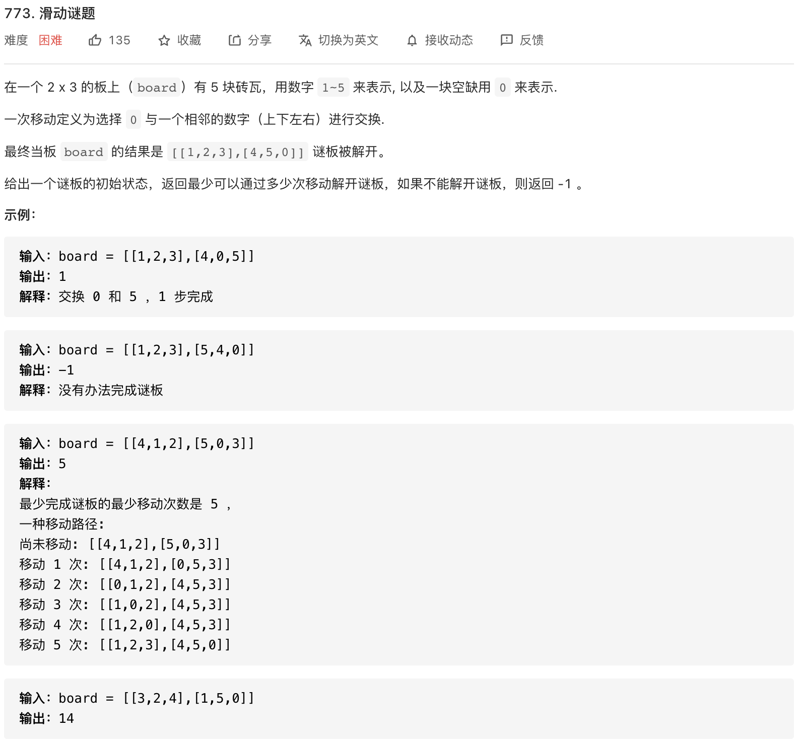

> 数据结构就是一组数据的存储结构，算法就是操作数据的一组方法。数据结构是为算法服务的，算法要作用在特定的数据结构之上。

# 数据结构 - 线性表

## 数组
数组是连续的内存空间，用来存储一组相同类型的数据。数组具有高效随机访问的特征，但插入和删除低效。

为什么数组下标要从0开始？从内存模型上看，数组的下标的含义是偏移。  

## 链表

链表是通过指针将一组零散的内存块串联在一起的数据结构，把这些内存块称作链表的节点。链表的插入、删除操作的高效的，但查找访问低效。

* 单向链表


* 双向链表


* 循环链表


* 跳表

  跳表是一种基于链表实现二分查找的动态数据结构，支持快速插入、删除、查找的操作，时间复杂度是O(logn)。跳表的设计思路是使用空间换时间，通过多级索引来提高查询效率。


## 栈

栈是一种操作受限的线性表，只允许在一端插入和删除数据，并且满足先进后出、后进先出的特性。栈只支持两个操作：入栈、出栈，也就是从栈顶插入或删除一个数据。栈可以用数组和链表来实现，分别叫做顺序栈和链式栈。

栈的应用：函数调用、表达式求值、括号匹配、工具的前进后退功能。  

## 队列


队列是一种操作受限的线性表，满足先进先出的特性。只支持两个操作：入队，在队尾添加一个元素、出队，从队头取一个元素。队列可以用数组和链表来实现，分别叫做顺序队列和链式队列。

队列的应用：对于资源有限的场景，当没有空闲资源时，可以通过队列来实现请求排队等待。例如：当线程池没有空闲线程的情况下，通过一个基于数组实现的有界阻塞队列，当新任务请求线程资源时，入队阻塞等待，等到有空闲线程时则任务出队分配线程资源。若队列中阻塞等待的任务请求超过了队列的大小，接下来的任务请求都会被拒绝。

* 循环队列
* 阻塞队列
* 并发队列
* 阻塞并发队列


# 数据结构 - 散列表


```
HashFunction(Key) = index, table[index] = Key
```

散列表也叫哈希表，用的是数组支持下标随机访问数据的特性，所以散列表是数组的一种扩展，由数组演化而来。将键值通过散列函数映射转化为散列表，把散列表的值作为数组下标去存储数据。在查询时，同样将键值通过同个散列函数转化为数组下标，取得数据。


## 散列函数
将任意长度的二进制值映射为固定长度的二进制串

**特性**：

* 从哈希值不能反向推导出原始数据。对输入数据敏感，哪怕值修改一个bit，得到的哈希值也大不相同。
* 如果key1=key2，那么hash(key1)=hash(key2)；如果key1≠key2，那么hash(key1)≠hash(key2)。
* 即便是MD5、SHA、CRC等再好的哈希算法也无法避免产生散列冲突。散列冲突概率要很小，散列函数的好坏决定了散列冲突的概率，影响着散列表的性能。
* 哈希算法的执行效率要尽量高效，针对较长的数据，也能快速计算出哈希值。

**设计方法**：

- 除法散列法

  关键字 Key 映射到 m 个槽中的某一位置，散列函数为：`h(Key) = Key mod m`，其中 m 不应是 2 的幂，通常 m 的值是与 2 的整数幂不太接近的质数。`table[h(Key)] = Key`

- 乘法散列法

  用关键字 key 乘上常数 A(0<A<1)，并抽取出 `key*A` 的小数部分。用 m 乘以这个抽取出来的小数，再对乘积向下取整(floor)。散列函数为：`h(Key) = floor(m*(Key*A mod 1))`； 其中 mod 1 的意思就是取小数部分。 `Key*A mod 1` 即为 `Key*A - floor(Key*A)`。

  乘法散列法的优点是对 m 的选择没什么特别的要求。一般选 m 为 2 的某次幂(2^p，p为某个整数)

## 散列冲突

再好的散列函数也无法避免散列冲突。那究竟该如何解决散列冲突问题呢？我们常用的散列冲突解决方法有两类，开放寻址法（open addressing）和链表法（chaining）。

1. 开放寻址法：如果出现了散列冲突，我们就重新探测一个空闲位置，将其插入。


2. 链表法：每个桶（bucket）或者槽（slot）会对应一条链表，所有散列值相同的元素我们都放到相同槽位对应的链表中。


# 数据结构 - 树

## 二叉树


* **满二叉树**：叶子节点全都在最底层，除了叶子节点之外，每个节点都有左右两个子节点。（2）
* **完全二叉树**：叶子节点都在最底下两层，最后一层的叶子节点都靠左排列，并且除了最后一层，其他层的节点个数都要达到最大。（3）
* **二叉查找树**：在树中的任意一个节点，其左子树中的每个节点的值，都要小于这个节点的值，而右子树节点的值都大于这个节点的值。
* **平衡二叉树**：二叉树中任意一个节点的左右子树的高度相差不能大于1。
* **平衡二叉查找树**：AVL树、红黑树


1. **前序遍历**：对任意节点，先打印**节点本身**，然后再打印它的左子树，最后打印它的右子树。
2. **中序遍历**：对任意节点，先打印它的左子树，然后再打印**节点本身**，最后打印它的右子树。
3. **后序遍历**：对任意节点，先打印它的左子树，然后再打印它的右子树，最后打印**节点本身**。

## 多路查找树

* B树
* B+树
* 2-3-4树

## 堆


堆其实就是一棵完全二叉树，父节点的值比每一个子节点的值都要大/小。

* 大顶堆：堆顶元素为最大项（1、2）
* 小顶堆：堆顶元素为最小项（3）


# 数据结构 - 图

## 类型

**无向图、无向权重图、有向图、有向权重图**


图中的节点我们称为顶点(Vertex)其缩写为 `V`，边(Edge)缩写为 `E`。另外，顶点和边还有一个概念叫**度**(degree)表示一个顶点相邻边数，而**有向图**中如果存在顶点 A 有一条指向顶点 B 的边，则对于顶点 B 这条边称为**入度**，相反，对于顶点 A 这条边则称为**出度**。

我们日常使用的微信中记录的好友关系则可以使用**无向图**表示；如果有玩过王者荣耀，则对游戏中的好友之间的亲密度不陌生，好友关系及亲密度则可以使用**无向权重图**表示；还有我们的微博和现在使用的语雀中的关注功能表示两个用户的单向关系则可以使用**有向图**表示；如果你有一部手机，那么必不可少的就是导航软件，其中的地图就可以使用使用**有向权重图**表示两个地点的方向和两个地点的距离。

## 表示方法

- **邻接矩阵(Adjacency Matrices)**


邻接矩阵的**优点**是查找快捷，如果给定一个 `edge(i,j)` 的边，则可直接在矩阵中通过 `graph[i][j]` 查询。直观且表现力强，**无向图**中为 1 的数字总是对称，而对于**无向权重图**则是非 0 的数字总是对称。

邻接矩阵的**缺点**是在矩阵中存在较多的值为 0 的元素时，这些多余元素的存在明显占据着额外的内存，这对于稀疏图来说十分不友好。

- **邻接表(Adjacency Lists)**


邻接表的优势是既省空间且计算和查询速度更快。

现在再来计算一个顶点度数(边数)或获取该顶点对应**出度**的所有顶点，首先需要说明的是散列表查询一个顶点的时间复杂度是 `O(1)`，我们发现度数就是链表的长度，所以时间复杂度是 `O(1)`，获取**出度**的所有顶点，其时间复杂度是 `O(D)`，D 为顶点的度数(degree)，值范围是 `0 <= D <= V`。其空间复杂度又是多少呢？以**无向图**为例计算，所有顶点需要一个数组记录，且每个顶点对应储存的列表与度(degree)有关，因此需要的空间复杂度为 `O(V+D)`。

- **逆邻接表(Inverse Adjacency Lists)**

邻接表似乎已经很完美了，但我们要是换一个问题，把获取该顶点对应**出度**的所有顶点改为获取该顶点对应**入度**的所有顶点。这个时候邻接表就用不上了，如果使用暴力遍历的方式效率也会非常低下，时间复杂度也会变得很高。如果我们把**有向图**中的**出度**和**入度**互换，相当于将方向逆转，以**有向权重图**为例，参考下图**逆邻接表**的构造过程。


以微博作为实际例子，顶点的**出度**表示用户关注另一个用户，顶点的**入度**表示用户被关注，如果**邻接表**能计算出一个用户关注的所有用户，那**逆邻接表**就能计算出关注该用户的所有用户。

## 遍历搜索

* **广度优先搜索BFS**：从图的一个未访问的顶点 V 开始，先遍历这个节点的相邻节点，再依遍次历每个相邻节点的相邻节点。


* **深度优先搜索DFS**：从图中一个未访问的顶点 V 开始，沿着一条路走到底，然后从这条路尽头的节点回退到上一个节点，再从另一条路开始走到底，不断递归重复此过程，直到所有的顶点都遍历完成。


# 算法 - [排序](https://github.com/CyC2018/CS-Notes/blob/master/notes/%E7%AE%97%E6%B3%95%20-%20%E6%8E%92%E5%BA%8F.md)

**O(n^2)**

* **冒泡排序**：比较两个数据，将大的数据交换到后面。
* **插入排序**：将数据分为已排序区间、未排序区间，将未排序区间的数据一个个拿出来，比较后插入到已排序区间。（类似于插牌的习惯）
* **选择排序**：将数据分为已排序区间、未排序区间，比较找到未排序区间的最小值，插入到已排序区间末尾。
* **希尔排序**：将数据按一个间隔值取出，组成多个子序列，对每个序列进行插入排序。逐次递减间隔值，重复操作。

**O(nlogn)**

* **归并排序**：将数据从中间分解为前后两组，重复递归分解。对分解后的数据进行排序合并，重复递归合并。
* **快速排序**：在数据区间中取一个分区点数据，比分区点小的数据放左边，比分区点大的数据放右边，对左右两边的数据重复递归操作。
* **堆排序**：将数据构建成一个大顶堆；将堆顶元素与末尾元素交换，最大元素沉到数组末端；重新调整剩余数据使其满足堆定义，然后继续交换堆顶元素与当前末尾元素，反复执行调整 + 交换步骤，直到整个序列有序。

**O(n)**

* **桶排序**：将要排序的数据分到几个有序的桶里面，每个桶对数据单独进行排序，再把每个痛里面的数据按顺序取出。（如果数据极端分布不均匀，会造成桶内的排序算法O(n)退化。桶排序适合用在外部排序，数据量比较大，内存有限时，可以利用桶排序将数据存储到外部磁盘中。）
* **计数排序**：可以理解为一种特殊的桶排序，对每个数据设置一个桶。适用于数据量比数据范围大很多的正整数排序。（给100万的考生分数排序）
* **基数排序**：将每个数据分割成独立的位，位之间有递进的关系，对每个位进行稳定排序。（给10万个手机号排序）


# 算法 - 数组

## 1. 二分查找 - 寻找一个数

```java
// 二分查找框架
int binarySearch(int[] nums, int target) {
    int left = 0, right = ...;

    while(...) {
        int mid = left + (right - left) / 2; // left + (right - left) / 2 就和 (left + right) / 2 的结果相同，但是有效防止了 left 和 right 太大直接相加导致溢出。
        if (nums[mid] == target) {
            ...
        } else if (nums[mid] < target) {
            left = ...
        } else if (nums[mid] > target) {
            right = ...
        }
    }
    return ...;
}
```

分析二分查找的一个技巧是，不要出现 else，把所有情况用 else if 写清楚，这样可以清楚地展现所有细节。二分查找真正的坑是在于到底要给 `mid` 加一还是减一，while 里到底用 `<=` 还是 `<`。思路很简单，细节是魔鬼。

```java
// 寻找一个数
int binarySearch(int[] nums, int target) {
    int left = 0; 
    int right = nums.length - 1; // 注意

    while(left <= right) {
        int mid = left + (right - left) / 2;
        if(nums[mid] == target)
            return mid; 
        else if (nums[mid] < target)
            left = mid + 1; // 注意
        else if (nums[mid] > target)
            right = mid - 1; // 注意
    }
    return -1;
}
```

该算法存在局限性。比如说给你有序数组 `nums = [1,2,2,2,3]`，`target` 为 2，此算法返回的索引是 2，没错。但是如果我想得到 `target` 的左侧边界，即索引 1，或者我想得到 `target` 的右侧边界，即索引 3，这样的话此算法是无法处理的。

这样的需求很常见，你也许会说，找到一个 target，然后向左或向右线性搜索不行吗？可以，但是不好，因为这样难以保证二分查找对数级的复杂度了。接下来看「寻找左侧边界」、「寻找右侧边界」这两种二分查找的算法。

```java
int binary_search(int[] nums, int target) {
    int left = 0, right = nums.length - 1; 
    while(left <= right) {
        int mid = left + (right - left) / 2;
        if (nums[mid] < target) {
            left = mid + 1;
        } else if (nums[mid] > target) {
            right = mid - 1; 
        } else if(nums[mid] == target) {
            // 直接返回
            return mid;
        }
    }
    // 直接返回
    return -1;
}

// 寻找左侧边界
int left_bound(int[] nums, int target) {
    int left = 0, right = nums.length - 1;
    while (left <= right) {
        int mid = left + (right - left) / 2;
        if (nums[mid] < target) {
            left = mid + 1;
        } else if (nums[mid] > target) {
            right = mid - 1;
        } else if (nums[mid] == target) {
            // 别返回，锁定左侧边界
            right = mid - 1;
        }
    }
    // 最后要检查 left 越界的情况
    if (left >= nums.length || nums[left] != target)
        return -1;
    return left;
}

// 寻找右侧边界
int right_bound(int[] nums, int target) {
    int left = 0, right = nums.length - 1;
    while (left <= right) {
        int mid = left + (right - left) / 2;
        if (nums[mid] < target) {
            left = mid + 1;
        } else if (nums[mid] > target) {
            right = mid - 1;
        } else if (nums[mid] == target) {
            // 别返回，锁定右侧边界
            left = mid + 1;
        }
    }
    // 最后要检查 right 越界的情况
    if (right < 0 || nums[right] != target)
        return -1;
    return right;
}
```

**1、基本的二分查找算法**

```
因为我们初始化 right = nums.length - 1
所以决定了我们的「搜索区间」是 [left, right]
所以决定了 while (left <= right)
同时也决定了 left = mid+1 和 right = mid-1

因为我们只需找到一个 target 的索引即可
所以当 nums[mid] == target 时可以立即返回
```

**2、寻找左侧边界的二分查找**

```
因为我们初始化 right = nums.length
所以决定了我们的「搜索区间」是 [left, right)
所以决定了 while (left < right)
同时也决定了 left = mid + 1 和 right = mid

因为我们需找到 target 的最左侧索引
所以当 nums[mid] == target 时不要立即返回
而要收紧右侧边界以锁定左侧边界
```

**3、寻找右侧边界的二分查找**

```
因为我们初始化 right = nums.length
所以决定了我们的「搜索区间」是 [left, right)
所以决定了 while (left < right)
同时也决定了 left = mid + 1 和 right = mid

因为我们需找到 target 的最右侧索引
所以当 nums[mid] == target 时不要立即返回
而要收紧左侧边界以锁定右侧边界

又因为收紧左侧边界时必须 left = mid + 1
所以最后无论返回 left 还是 right，必须减一
```

如果想用二分查找技巧优化算法，首先要把 for 循环形式的暴力算法写出来，如果算法中存在如下形式的 for 循环：

```c++
// func(i) 是 i 的单调函数（递增递减都可以）
int func(int i);

// 形如这种 for 循环可以用二分查找技巧优化效率
for (int i = 0; i < n; i++) {
    if (func(i) == target)
        return i;
}
```

## 2. 二分查找 - 吃香蕉最小速度


也就是说，Koko 每小时最多吃一堆香蕉，如果吃不下的话留到下一小时再吃；如果吃完了这一堆还有胃口，也只会等到下一小时才会吃下一堆。在这个条件下，让我们确定 Koko 吃香蕉的最小速度（根/小时）。

那么我们先抛开二分查找技巧，想想如何暴力解决这个问题呢？首先，算法要求的是`H` 小时内吃完香蕉的最小速度，我们不妨称为 `speed`，请问 `speed` 最大可能为多少，最少可能为多少呢？显然最少为 1，最大为 `max(piles)`，因为一小时最多只能吃一堆香蕉。那么暴力解法就很简单了，只要从 1 开始穷举到 `max(piles)`，一旦发现发现某个值可以在 `H` 小时内吃完所有香蕉，这个值就是最小速度：

```java
int minEatingSpeed(int[] piles, int H) {
	// piles 数组的最大值
    int max = getMax(piles);
    for (int speed = 1; speed < max; speed++) {
    	// 以 speed 是否能在 H 小时内吃完香蕉
        if (canFinish(piles, speed, H))
            return speed;
    }
    return max;
}
```

注意这个 for 循环，就是在**连续的空间线性搜索，这就是二分查找可以发挥作用的标志**。由于我们要求的是最小速度，所以可以用一个搜索左侧边界的二分查找来代替线性搜索，提升效率，借助二分查找技巧，算法的时间复杂度为 O(NlogN)。

```java
int minEatingSpeed(int[] piles, int H) {
    // 套用搜索左侧边界的算法框架
    int left = 1, right = getMax(piles) + 1;
    while (left < right) {
        // 防止溢出
        int mid = left + (right - left) / 2;
        if (canFinish(piles, mid, H)) {
            right = mid;
        } else {
            left = mid + 1;
        }
    }
    return left;
}

// 时间复杂度 O(N)
boolean canFinish(int[] piles, int speed, int H) {
    int time = 0;
    for (int n : piles) {
        time += timeOf(n, speed);
    }
    return time <= H;
}

int timeOf(int n, int speed) {
    return (n / speed) + ((n % speed > 0) ? 1 : 0);
}

int getMax(int[] piles) {
    int max = 0;
    for (int n : piles)
        max = Math.max(n, max);
    return max;
}
```

## 3. 二分查找 - 最低运输能力


其实本质上和 Koko 吃香蕉的问题一样的，首先确定 `cap` 的最小值和最大值分别为 `max(weights)` 和 `sum(weights)`。我们要求最小载重，所以可以用搜索左侧边界的二分查找算法优化线性搜索：

```java
// 寻找左侧边界的二分查找
int shipWithinDays(int[] weights, int D) {
	// 载重可能的最小值
    int left = getMax(weights);
	// 载重可能的最大值 + 1
    int right = getSum(weights) + 1;
    while (left < right) {
        int mid = left + (right - left) / 2;
        if (canFinish(weights, D, mid)) {
            right = mid;
        } else {
            left = mid + 1;
        }
    }
    return left;
}

// 如果载重为 cap，是否能在 D 天内运完货物？
boolean canFinish(int[] w, int D, int cap) {
    int i = 0;
    for (int day = 0; day < D; day++) {
        int maxCap = cap;
        while ((maxCap -= w[i]) >= 0) {
            i++;
            if (i == w.length)
                return true;
        }
    }
    return false;
}
```

## 4. 双指针 - 快慢指针

> 主要解决链表中的问题

**1、判定链表中是否含有环**

经典解法就是用两个指针，一个跑得快，一个跑得慢。如果不含有环，跑得快的那个指针最终会遇到 `null`，说明链表不含环；如果含有环，快指针最终会超慢指针一圈，和慢指针相遇，说明链表含有环。

```java
boolean hasCycle(ListNode head) {
    ListNode fast, slow;
    fast = slow = head;
    while (fast != null && fast.next != null) {
        fast = fast.next.next;
        slow = slow.next;
        
        if (fast == slow) return true;
    }
    return false;
}
```

**2、已知链表中含有环，返回这个环的起始位置**

当快慢指针相遇时，让其中任一个指针指向头节点，然后让它俩以相同速度前进，再次相遇时所在的节点位置就是环开始的位置。这是为什么呢？

第一次相遇时，假设慢指针 `slow` 走了 `k` 步，那么快指针 `fast` 一定走了 `2k` 步；`fast` 一定比 `slow` 多走了 `k` 步，这多走的 `k` 步其实就是 `fast` 指针在环里转圈圈，所以 `k` 的值就是环长度的「整数倍」。


设相遇点距环的起点的距离为 `m`，那么环的起点距头结点 `head` 的距离为 `k - m`，也就是说如果从 `head` 前进 `k - m` 步就能到达环起点。如果从相遇点继续前进 `k - m` 步，也恰好到达环起点。你甭管 `fast` 在环里到底转了几圈，反正走 `k` 步可以到相遇点，那走 `k - m` 步一定就是走到环起点了。


```java
ListNode detectCycle(ListNode head) {
    ListNode fast, slow;
    fast = slow = head;
    while (fast != null && fast.next != null) {
        fast = fast.next.next;
        slow = slow.next;
        if (fast == slow) break;
    }
    // 上面的代码类似 hasCycle 函数
    if (fast == null || fast.next == null) {
        // fast 遇到空指针说明没有环
        return null;
    }

    slow = head;
    while (slow != fast) {
        fast = fast.next;
        slow = slow.next;
    }
    return slow;
}
```

**3、寻找链表的倒数第 n 个元素**


让快指针先走 `n` 步，然后快慢指针开始同速前进。这样当快指针走到链表末尾 `null` 时，慢指针所在的位置就是倒数第 `n` 个链表节点（`n` 不会超过链表长度）。

```java
ListNode removeNthFromEnd(ListNode head, int n) {
    ListNode fast, slow;
    fast = slow = head;
    // 快指针先前进 n 步
    while (n-- > 0) {
        fast = fast.next;
    }
    if (fast == null) {
        // 如果此时快指针走到头了，
        // 说明倒数第 n 个节点就是第一个节点
        return head.next;
    }
    // 让慢指针和快指针同步向前
    while (fast != null && fast.next != null) {
        fast = fast.next;
        slow = slow.next;
    }
    // slow.next 就是倒数第 n 个节点，删除它
    slow.next = slow.next.next;
    return head;
}
```

## 5. 双指针 - 左右指针

> 主要解决数组（或者字符串）中的问题。

主要介绍滑动窗口问题：维护一个窗口，不断滑动，更新答案。

```java
// 滑动窗口算法框架
void slidingWindow(string s, string t) {
    unordered_map<char, int> need, window;
    for (char c : t) need[c]++;
    
    int left = 0, right = 0;
    int valid = 0; 
    while (right < s.size()) {
        // c 是将移入窗口的字符
        char c = s[right];
        // 右移窗口
        right++;
        // 进行窗口内数据的一系列更新
        ...

        /*** debug 输出的位置 ***/
        printf("window: [%d, %d)\n", left, right);
        /********************/
        
        // 判断左侧窗口是否要收缩
        while (window needs shrink) {
            // d 是将移出窗口的字符
            char d = s[left];
            // 左移窗口
            left++;
            // 进行窗口内数据的一系列更新
            ...
        }
    }
}
```


初始状态：


增加 `right`，直到窗口 `[left, right]` 包含了 `T` 中所有字符。


现在开始增加 `left`，缩小窗口 `[left, right]`。


直到窗口中的字符串不再符合要求，`left` 不再继续移动。


之后重复上述过程，先移动 `right`，再移动 `left`…… 直到 `right` 指针到达字符串 `S` 的末端，算法结束。

```c++
string minWindow(string s, string t) {
    unordered_map<char, int> need, window;
    for (char c : t) need[c]++;

    int left = 0, right = 0;
    int valid = 0;
    // 记录最小覆盖子串的起始索引及长度
    int start = 0, len = INT_MAX;
    while (right < s.size()) {
        // c 是将移入窗口的字符
        char c = s[right];
        // 右移窗口
        right++;
        // 进行窗口内数据的一系列更新
        if (need.count(c)) {
            window[c]++;
            if (window[c] == need[c])
                valid++;
        }

        // 判断左侧窗口是否要收缩
        while (valid == need.size()) {
            // 在这里更新最小覆盖子串
            if (right - left < len) {
                start = left;
                len = right - left;
            }
            // d 是将移出窗口的字符
            char d = s[left];
            // 左移窗口
            left++;
            // 进行窗口内数据的一系列更新
            if (need.count(d)) {
                if (window[d] == need[d])
                    valid--;
                window[d]--;
            }                    
        }
    }
    // 返回最小覆盖子串
    return len == INT_MAX ?
        "" : s.substr(start, len);
}
```


# 算法 - 链表

```java
// 单链表节点的结构
public class ListNode {
    int val;
    ListNode next;
    ListNode(int x) { val = x; }
}
```

## 1. 递归反转整个链表


```java
ListNode reverse(ListNode head) {
    if (head.next == null) return head;
    ListNode last = reverse(head.next);
    head.next.next = head;
    head.next = null;
    return last;
}
```

我们的 `reverse` 函数定义是这样的：输入一个节点 `head`，将「以 `head` 为起点」的链表反转，并返回反转之后的头结点。


## 2. 反转链表前N个节点

这次我们实现一个这样的函数：将链表的前 n 个节点反转（n <= 链表长度）

```java
ListNode reverseN(ListNode head, int n)
```

比如说对于下图链表，执行 `reverseN(head, 3)`


解决思路和反转整个链表差不多，只要稍加修改即可

```java
ListNode successor = null; // 后驱节点

// 反转以 head 为起点的 n 个节点，返回新的头结点
ListNode reverseN(ListNode head, int n) {
    if (n == 1) { 
        // 记录第 n + 1 个节点
        successor = head.next;
        return head;
    }
    // 以 head.next 为起点，需要反转前 n - 1 个节点
    ListNode last = reverseN(head.next, n - 1);

    head.next.next = head;
    // 让反转之后的 head 节点和后面的节点连起来
    head.next = successor;
    return last;
}    
```

## 3. 反转链表的一部分

现在解决我们最开始提出的问题，给一个索引区间 `[m,n]`（索引从 1 开始），仅仅反转区间中的链表元素。

```java
ListNode reverseBetween(ListNode head, int m, int n)
```

首先，如果 `m == 1`，就相当于反转链表开头的 `n` 个元素嘛，也就是我们刚才实现的功能：

```java
ListNode reverseBetween(ListNode head, int m, int n) {
    // base case
    if (m == 1) {
        // 相当于反转前 n 个元素
        return reverseN(head, n);
    }
    // ...
}
```

如果 `m != 1` 怎么办？如果我们把 `head` 的索引视为 1，那么我们是想从第 `m` 个元素开始反转对吧；如果把 `head.next` 的索引视为 1 呢？那么相对于 `head.next`，反转的区间应该是从第 `m - 1` 个元素开始的；那么对于 `head.next.next` 呢……

区别于迭代思想，这就是递归思想，所以我们可以完成代码：

```java
ListNode reverseBetween(ListNode head, int m, int n) {
    // base case
    if (m == 1) {
        return reverseN(head, n);
    }
    // 前进到反转的起点触发 base case
    head.next = reverseBetween(head.next, m - 1, n - 1);
    return head;
}
```

## 4. K个一组反转链表

我们对这个链表调用 `reverseKGroup(head, 2)`，即以 2 个节点为一组反转链表：


如果我设法把前 2 个节点反转，那么后面的那些节点怎么处理？后面的这些节点也是一条链表，而且规模（长度）比原来这条链表小，这就叫子问题。


我们可以直接递归调用 `reverseKGroup(cur, 2)`，因为子问题和原问题的结构完全相同，这就是所谓的递归性质。

```java
// 反转区间 [a, b) 的元素，注意是左闭右开
ListNode reverse(ListNode a, ListNode b) {
    ListNode pre, cur, nxt;
    pre = null; cur = a; nxt = a;
    // while 终止的条件改一下就行了
    while (cur != b) {
        nxt = cur.next;
        cur.next = pre;
        pre = cur;
        cur = nxt;
    }
    // 返回反转后的头结点
    return pre;
}

ListNode reverseKGroup(ListNode head, int k) {
    if (head == null) return null;
    // 区间 [a, b) 包含 k 个待反转元素
    ListNode a, b;
    a = b = head;
    for (int i = 0; i < k; i++) {
        // 不足 k 个，不需要反转，base case
        if (b == null) return head;
        b = b.next;
    }
    // 反转前 k 个元素
    ListNode newHead = reverse(a, b);
    // 递归反转后续链表并连接起来
    a.next = reverseKGroup(b, k);
    return newHead;
}
```


# 算法 - 二叉树

```c
/* 二叉树遍历框架 */
void traverse(TreeNode root) {
    // 前序遍历
    traverse(root.left)
    // 中序遍历
    traverse(root.right)
    // 后序遍历
}
```

**递归**算法的秘诀：明确函数的「定义」是什么，然后相信这个定义，利用这个定义推导最终结果，绝不要跳入递归的细节。

```c
// 定义：count(root) 返回以 root 为根的树有多少节点
int count(TreeNode root) {
    // base case
    if (root == null) return 0;
    // 自己加上子树的节点数就是整棵树的节点数
    return 1 + count(root.left) + count(root.right);
}
```

**快速排序**就是个二叉树的前序遍历

```c
void sort(int[] nums, int lo, int hi) {
    /****** 前序遍历位置 ******/
    // 通过交换元素构建分界点 p
    int p = partition(nums, lo, hi);
    /************************/

    sort(nums, lo, p - 1);
    sort(nums, p + 1, hi);
}
```

**归并排序**就是个二叉树的后序遍历

```c
void sort(int[] nums, int lo, int hi) {
    int mid = (lo + hi) / 2;
    sort(nums, lo, mid);
    sort(nums, mid + 1, hi);

    /****** 后序遍历位置 ******/
    // 合并两个排好序的子数组
    merge(nums, lo, mid, hi);
    /************************/
}
```

## 1. 翻转二叉树

```
输入一个二叉树根节点 root，让你把整棵树镜像翻转，比如输入的二叉树如下：
     4
   /   \
  2     7
 / \   / \
1   3 6   9
算法原地翻转二叉树，使得以 root 为根的树变成：
     4
   /   \
  7     2
 / \   / \
9   6 3   1
```

通过观察，我们发现只要把二叉树上的每一个节点的左右子节点进行交换，最后的结果就是完全翻转之后的二叉树。二叉树题目的一个难点就是，如何把题目的要求细化成每个节点需要做的事情。

```c
// 将整棵树的节点翻转
TreeNode invertTree(TreeNode root) {
    // base case
    if (root == null) {
        return null;
    }

    /**** 前序遍历位置 ****/
    // root 节点需要交换它的左右子节点
    TreeNode tmp = root.left;
    root.left = root.right;
    root.right = tmp;

    // 让左右子节点继续翻转它们的子节点
    invertTree(root.left);
    invertTree(root.right);
    
    return root;
}
```

## 2. 填充二叉树节点右侧指针


题目的意思就是把二叉树的每一层节点都用 `next` 指针连接起来：


把每一层的节点穿起来，是不是只要把每个节点的左右子节点都穿起来就行了？

```java
Node connect(Node root) {
    if (root == null || root.left == null) {
        return root;
    }

    root.left.next = root.right;

    connect(root.left);
    connect(root.right);

    return root;
}
```

节点 5 和节点 6 不属于同一个父节点，那么按照这段代码的逻辑，它俩就没办法被穿起来，这是不符合题意的。

回想刚才说的，**二叉树的问题难点在于，如何把题目的要求细化成每个节点需要做的事情**，但是如果只依赖一个节点的话，肯定是没办法连接「跨父节点」的两个相邻节点的。

那么，我们的做法就是增加函数参数，一个节点做不到，我们就给他安排两个节点，「将每一层二叉树节点连接起来」可以细化成「将每两个相邻节点都连接起来」：

```java
// 主函数
Node connect(Node root) {
    if (root == null) return null;
    connectTwoNode(root.left, root.right);
    return root;
}

// 辅助函数
void connectTwoNode(Node node1, Node node2) {
    if (node1 == null || node2 == null) {
        return;
    }
    /**** 前序遍历位置 ****/
    // 将传入的两个节点连接
    node1.next = node2;
    
    // 连接相同父节点的两个子节点
    connectTwoNode(node1.left, node1.right);
    connectTwoNode(node2.left, node2.right);
    // 连接跨越父节点的两个子节点
    connectTwoNode(node1.right, node2.left);
}
```

## 3. 二叉树展开为链表


我们尝试给出这个函数的定义：给 `flatten` 函数输入一个节点 `root`，那么以 `root` 为根的二叉树就会被拉平为一条链表。

1、将 `root` 的左子树和右子树拉平。

2、将 `root` 的右子树接到左子树下方，然后将整个左子树作为右子树。


```java
// 定义：将以 root 为根的树拉平为链表
void flatten(TreeNode root) {
    // base case
    if (root == null) return;
    
    flatten(root.left);
    flatten(root.right);

    /**** 后序遍历位置 ****/
    // 1、左右子树已经被拉平成一条链表
    TreeNode left = root.left;
    TreeNode right = root.right;
    
    // 2、将左子树作为右子树
    root.left = null;
    root.right = left;

    // 3、将原先的右子树接到当前右子树的末端
    TreeNode p = root;
    while (p.right != null) {
        p = p.right;
    }
    p.right = right;
}
```

## 4. 构造最大二叉树


**对于构造二叉树的问题，根节点要做的就是把想办法把自己构造出来**。我们肯定要遍历数组把找到最大值 `maxVal`，把根节点 `root` 做出来，然后对 `maxVal` 左边的数组和右边的数组进行递归调用，作为 `root` 的左右子树。

按照题目给出的例子，输入的数组为 `[3,2,1,6,0,5]`，对于整棵树的根节点来说，其实在做这件事：

```java
TreeNode constructMaximumBinaryTree(int[] nums) {
    if (nums is empty) return null;
    // 找到数组中的最大值
    int maxVal = Integer.MIN_VALUE;
    int index = 0;
    for (int i = 0; i < nums.length; i++) {
        if (nums[i] > maxVal) {
            maxVal = nums[i];
            index = i;
        }
    }

    TreeNode root = new TreeNode(maxVal);
    // 递归调用构造左右子树
    root.left = constructMaximumBinaryTree(nums[0..index-1]);
    root.right = constructMaximumBinaryTree(nums[index+1..nums.length-1]);
    return root;
}
```

对于每个根节点，只需要找到当前 `nums` 中的最大值和对应的索引，然后递归调用左右数组构造左右子树即可。

```java
/* 主函数 */
TreeNode constructMaximumBinaryTree(int[] nums) {
    return build(nums, 0, nums.length - 1);
}

/* 将 nums[lo..hi] 构造成符合条件的树，返回根节点 */
TreeNode build(int[] nums, int lo, int hi) {
    // base case
    if (lo > hi) {
        return null;
    }

    // 找到数组中的最大值和对应的索引
    int index = -1, maxVal = Integer.MIN_VALUE;
    for (int i = lo; i <= hi; i++) {
        if (maxVal < nums[i]) {
            index = i;
            maxVal = nums[i];
        }
    }

    TreeNode root = new TreeNode(maxVal);
    // 递归调用构造左右子树
    root.left = build(nums, lo, index - 1);
    root.right = build(nums, index + 1, hi);
    
    return root;
}
```

## 5. 前序和中序遍历结果构造二叉树


遍历顺序差异，导致了`preorder`和`inorder`数组中的元素分布有如下特点：


```java
/* 主函数 */
TreeNode buildTree(int[] preorder, int[] inorder) {
    return build(preorder, 0, preorder.length - 1,
                 inorder, 0, inorder.length - 1);
}

/* 
前序遍历数组为 preorder[preStart..preEnd]，
后续遍历数组为 postorder[postStart..postEnd]，
构造二叉树，返回该二叉树的根节点 
*/
TreeNode build(int[] preorder, int preStart, int preEnd, 
               int[] inorder, int inStart, int inEnd) {
    // root 节点对应的值就是前序遍历数组的第一个元素
    int rootVal = preorder[preStart];
    // rootVal 在中序遍历数组中的索引
    int index = 0;
    for (int i = inStart; i <= inEnd; i++) {
        if (inorder[i] == rootVal) {
            index = i;
            break;
        }
    }

    TreeNode root = new TreeNode(rootVal);
    // 递归构造左右子树
    root.left = build(preorder, ?, ?,
                      inorder, ?, ?);

    root.right = build(preorder, ?, ?,
                       inorder, ?, ?);
    return root;
}
```

对于`inorder`数组的起始索引和终止索引比较容易确定：


```java
root.left = build(preorder, ?, ?,
                  inorder, inStart, index - 1);
root.right = build(preorder, ?, ?,
                   inorder, index + 1, inEnd);
```

对于`preorder`数组，可以通过左子树的节点数推导出来，假设左子树的节点数为`leftSize`，那么`preorder`数组上的索引情况是这样的：


```java
int leftSize = index - inStart;
root.left = build(preorder, preStart + 1, preStart + leftSize,
                  inorder, inStart, index - 1);
root.right = build(preorder, preStart + leftSize + 1, preEnd,
                   inorder, index + 1, inEnd);
```

## 6. 后序和中序遍历结果构造二叉树


遍历顺序差异，导致了`postorder`和`inorder`数组中的元素分布有如下特点：


现在`postoder`和`inorder`对应的状态如下：


```java
TreeNode buildTree(int[] inorder, int[] postorder) {
    return build(inorder, 0, inorder.length - 1,
                 postorder, 0, postorder.length - 1);
}

TreeNode build(int[] inorder, int inStart, int inEnd,
               int[] postorder, int postStart, int postEnd) {

    if (inStart > inEnd) {
        return null;
    }
    // root 节点对应的值就是后序遍历数组的最后一个元素
    int rootVal = postorder[postEnd];
    // rootVal 在中序遍历数组中的索引
    int index = 0;
    for (int i = inStart; i <= inEnd; i++) {
        if (inorder[i] == rootVal) {
            index = i;
            break;
        }
    }
    // 左子树的节点个数
    int leftSize = index - inStart;
    TreeNode root = new TreeNode(rootVal);
    // 递归构造左右子树
    root.left = build(inorder, inStart, index - 1,
                        postorder, postStart, postStart + leftSize - 1);

    root.right = build(inorder, index + 1, inEnd,
                        postorder, postStart + leftSize, postEnd - 1);
    return root;
}
```

## 7. 二叉树的序列化与反序列化

给你输入一棵二叉树的根节点 `root`，要求你实现如下一个类：

```java
public class Codec {

    // 把一棵二叉树序列化成字符串
    public String serialize(TreeNode root) {}

    // 把字符串反序列化成二叉树
    public TreeNode deserialize(String data) {}
}
```

我们可以用 `serialize` 方法将二叉树序列化成字符串，用 `deserialize` 方法将序列化的字符串反序列化成二叉树，至于以什么格式序列化和反序列化，这个完全由你决定。

以**前序遍历**为例：


```java
String SEP = ",";
String NULL = "#";

/* 主函数，将二叉树序列化为字符串 */
String serialize(TreeNode root) {
    StringBuilder sb = new StringBuilder();
    serialize(root, sb);
    return sb.toString();
}

/* 辅助函数，将二叉树存入 StringBuilder */
void serialize(TreeNode root, StringBuilder sb) {
    if (root == null) {
        sb.append(NULL).append(SEP);
        return;
    }

    /****** 前序遍历位置 ******/
    sb.append(root.val).append(SEP);
    /***********************/

    serialize(root.left, sb);
    serialize(root.right, sb);
}
```

一般语境下，单单前序遍历结果是不能还原二叉树结构的，因为缺少空指针的信息，至少要得到前、中、后序遍历中的两种才能还原二叉树。但是这里的 `node` 列表包含空指针的信息，所以只使用 `node` 列表就可以还原二叉树。

```java
/* 主函数，将字符串反序列化为二叉树结构 */
TreeNode deserialize(String data) {
    // 将字符串转化成列表
    LinkedList<String> nodes = new LinkedList<>();
    for (String s : data.split(SEP)) {
        nodes.addLast(s);
    }
    return deserialize(nodes);
}

/* 辅助函数，通过 nodes 列表构造二叉树 */
TreeNode deserialize(LinkedList<String> nodes) {
    if (nodes.isEmpty()) return null;

    /****** 前序遍历位置 ******/
    // 列表最左侧就是根节点
    String first = nodes.removeFirst();
    if (first.equals(NULL)) return null;
    TreeNode root = new TreeNode(Integer.parseInt(first));
    /***********************/

    root.left = deserialize(nodes);
    root.right = deserialize(nodes);

    return root;
}
```

## 8. 寻找重复子树


从某一个节点去看，需要知道以下两点信息：

1. 以我为根的这棵二叉树（子树）长啥样？
2. 以其他节点为根的子树都长啥样？

那应该怎么描述一棵二叉树的模样呢？我们可以通过拼接字符串的方式把二叉树序列化，看下代码：

```java
String traverse(TreeNode root) {
    // 对于空节点，可以用一个特殊字符表示
    if (root == null) {
        return "#";
    }
    // 将左右子树序列化成字符串
    String left = traverse(root.left);
    String right = traverse(root.right);
    /* 后序遍历代码位置 */
    // 左右子树加上自己，就是以自己为根的二叉树序列化结果
    String subTree = left + "," + right + "," + root.val;
    return subTree;
}
```

我们用非数字的特殊符`#`表示空指针，并且用字符`,`分隔每个二叉树节点值。

接着，我们借助一个外部数据结构，让每个节点把自己子树的序列化结果存进去，这样，对于每个节点，就可以知道有没有其他节点的子树和自己重复了。

```java
// 记录所有子树以及出现的次数
HashMap<String, Integer> memo = new HashMap<>();
// 记录重复的子树根节点
LinkedList<TreeNode> res = new LinkedList<>();

/* 主函数 */
List<TreeNode> findDuplicateSubtrees(TreeNode root) {
    traverse(root);
    return res;
}

/* 辅助函数 */
String traverse(TreeNode root) {
    if (root == null) {
        return "#";
    }

    String left = traverse(root.left);
    String right = traverse(root.right);

    String subTree = left + "," + right+ "," + root.val;

    int freq = memo.getOrDefault(subTree, 0);
    // 多次重复也只会被加入结果集一次
    if (freq == 1) {
        res.add(root);
    }
    // 给子树对应的出现次数加一
    memo.put(subTree, freq + 1);
    return subTree;
}
```

## 9. BST转化累加树


题目理解，比如图中的节点 5，转化成累加树的话，比 5 大的节点有 6，7，8，加上 5 本身，所以累加树上这个节点的值应该是 5+6+7+8=26。

BST 的中序遍历代码可以**升序**打印节点的值，如果想**降序**打印节点的值怎么办，只要把递归顺序改一下就行了。

```java
TreeNode convertBST(TreeNode root) {
    traverse(root);
    return root;
}

// 记录累加和
int sum = 0;
void traverse(TreeNode root) {
    if (root == null) {
        return;
    }
    traverse(root.right);
    // 维护累加和
    sum += root.val;
    // 将 BST 转化成累加树
    root.val = sum;
    traverse(root.left);
}
```

## 10. BST的合法性

先上错误代码：

```java
boolean isValidBST(TreeNode root) {
    if (root == null) return true;
    if (root.left != null && root.val <= root.left.val)
        return false;
    if (root.right != null && root.val >= root.right.val)
        return false;

    return isValidBST(root.left)
        && isValidBST(root.right);
}
```

出现问题的原因在于，对于每一个节点 `root`，代码值检查了它的左右孩子节点是否符合左小右大的原则；但是根据 BST 的定义，`root` 的整个左子树都要小于 `root.val`，整个右子树都要大于 `root.val`。

```java
boolean isValidBST(TreeNode root) {
    return isValidBST(root, null, null);
}

/* 限定以 root 为根的子树节点必须满足 max.val > root.val > min.val */
boolean isValidBST(TreeNode root, TreeNode min, TreeNode max) {
    // base case
    if (root == null) return true;
    // 若 root.val 不符合 max 和 min 的限制，说明不是合法 BST
    if (min != null && root.val <= min.val) return false;
    if (max != null && root.val >= max.val) return false;
    // 限定左子树的最大值是 root.val，右子树的最小值是 root.val
    return isValidBST(root.left, min, root) 
        && isValidBST(root.right, root, max);
}
```

## 11. BST中搜索一个数

如果是在二叉树中寻找元素，可以这样写代码：

```java
boolean isInBST(TreeNode root, int target) {
    if (root == null) return false;
    if (root.val == target) return true;
    // 当前节点没找到就递归地去左右子树寻找
    return isInBST(root.left, target)
        || isInBST(root.right, target);
}
```

这样写完全正确，但这段代码相当于穷举了所有节点，适用于所有普通二叉树。那么应该如何充分利用信息，把 BST 这个「左小右大」的特性用上？

很简单，其实不需要递归地搜索两边，类似二分查找思想，根据 `target` 和 `root.val` 的大小比较，就能排除一边。我们把上面的思路稍稍改动：

```java
boolean isInBST(TreeNode root, int target) {
    if (root == null) return false;
    if (root.val == target)
        return true;
    if (root.val < target) 
        return isInBST(root.right, target);
    if (root.val > target)
        return isInBST(root.left, target);
    // root 该做的事做完了，顺带把框架也完成了，妙
}
```

于是，我们对原始框架进行改造，抽象出一套**针对 BST 的遍历框架**：

```java
void BST(TreeNode root, int target) {
    if (root.val == target)
        // 找到目标，做点什么
    if (root.val < target) 
        BST(root.right, target);
    if (root.val > target)
        BST(root.left, target);
}
```

## 12. BST中插入一个数

对数据结构的操作无非遍历 + 访问，遍历就是「找」，访问就是「改」。具体到这个问题，插入一个数，就是先找到插入位置，然后进行插入操作。

上一个问题，我们总结了 BST 中的遍历框架，就是「找」的问题。直接套框架，加上「改」的操作即可。一旦涉及「改」，函数就要返回 `TreeNode` 类型，并且对递归调用的返回值进行接收。

```java
TreeNode insertIntoBST(TreeNode root, int val) {
    // 找到空位置插入新节点
    if (root == null) return new TreeNode(val);
    // if (root.val == val)
    //     BST 中一般不会插入已存在元素
    if (root.val < val) 
        root.right = insertIntoBST(root.right, val);
    if (root.val > val) 
        root.left = insertIntoBST(root.left, val);
    return root;
}
```

## 13. BST中删除一个数

这个问题稍微复杂，跟插入操作类似，先「找」再「改」，先把框架写出来再说：

```java
TreeNode deleteNode(TreeNode root, int key) {
    if (root.val == key) {
        // 找到啦，进行删除
    } else if (root.val > key) {
        // 去左子树找
        root.left = deleteNode(root.left, key);
    } else if (root.val < key) {
        // 去右子树找
        root.right = deleteNode(root.right, key);
    }
    return root;
}
```

找到目标节点了，比方说是节点 `A`，如何删除这个节点，这是难点。因为删除节点的同时不能破坏 BST 的性质。有三种情况，用图片来说明。

**情况 1**：`A` 恰好是末端节点，两个子节点都为空，那么它可以当场去世了。


```java
if (root.left == null && root.right == null)
    return null;
```

**情况 2**：`A` 只有一个非空子节点，那么它要让这个孩子接替自己的位置。


```java
// 排除了情况 1 之后
if (root.left == null) return root.right;
if (root.right == null) return root.left;
```

**情况 3**：`A` 有两个子节点，麻烦了，为了不破坏 BST 的性质，`A` 必须找到左子树中最大的那个节点，或者右子树中最小的那个节点来接替自己。我们以第二种方式讲解。


```java
if (root.left != null && root.right != null) {
    // 找到右子树的最小节点
    TreeNode minNode = getMin(root.right);
    // 把 root 改成 minNode
    root.val = minNode.val;
    // 转而去删除 minNode
    root.right = deleteNode(root.right, minNode.val);
}
```

三种情况分析完毕，填入框架，简化一下代码：

```java
TreeNode deleteNode(TreeNode root, int key) {
    if (root == null) return null;
    if (root.val == key) {
        // 这两个 if 把情况 1 和 2 都正确处理了
        if (root.left == null) return root.right;
        if (root.right == null) return root.left;
        // 处理情况 3
        TreeNode minNode = getMin(root.right);
        root.val = minNode.val;
        root.right = deleteNode(root.right, minNode.val);
    } else if (root.val > key) {
        root.left = deleteNode(root.left, key);
    } else if (root.val < key) {
        root.right = deleteNode(root.right, key);
    }
    return root;
}

TreeNode getMin(TreeNode node) {
    // BST 最左边的就是最小的
    while (node.left != null) node = node.left;
    return node;
} 
```

## 14. 不同的二叉搜索树

给你输入一个正整数 `n`，请你计算，存储 `{1,2,3...,n}` 这些值共有多少种不同的 BST 结构构建出所有合法的 BST。比如说输入 `n = 3`，算法返回 5，因为共有如下 5 种不同的 BST 结构存储 `{1,2,3}`：


举个例子，比如给算法输入 `n = 5`，也就是说用 `{1,2,3,4,5}` 这些数字去构造 BST。首先，这棵 BST 的根节点总共有几种情况？显然有 5 种情况对吧，因为每个数字都可以作为根节点。

比如说我们固定 `3` 作为根节点，这个前提下能有几种不同的 BST 呢？根据 BST 的特性，根节点的左子树都比根节点的值小，右子树的值都比根节点的值大。所以如果固定 `3` 作为根节点，左子树节点就是 `{1,2}` 的组合，右子树就是 `{4,5}` 的组合。**左子树的组合数和右子树的组合数乘积**就是 `3` 作为根节点时的 BST 个数。


```c++
// 备忘录
int[][] memo;

int numTrees(int n) {
    // 备忘录的值初始化为 0
    memo = new int[n + 1][n + 1];
    return count(1, n);
}

int count(int lo, int hi) {
    if (lo > hi) return 1;
    // 查备忘录
    if (memo[lo][hi] != 0) {
        return memo[lo][hi];
    }
    
    int res = 0;
    for (int mid = lo; mid <= hi; mid++) {
        int left = count(lo, mid - 1);
        int right = count(mid + 1, hi);
        res += left * right;
    }
    // 将结果存入备忘录
    memo[lo][hi] = res;
    
    return res;
}
```


# 算法 - 数据结构设计

## 1. Union-Find算法

Union-Find 算法，也就是常说的并查集算法，主要是解决图论中「动态连通性」问题的。

简单说，动态连通性其实可以抽象成给一幅图连线。比如下面这幅图，总共有 10 个节点，他们互不相连，分别用 0~9 标记。

Union-Find 算法主要需要实现这两个 API：

```java
class UF {
    /* 将 p 和 q 连接 */
    public void union(int p, int q);
    /* 判断 p 和 q 是否连通 */
    public boolean connected(int p, int q);
    /* 返回图中有多少个连通分量 */
    public int count();
}
```

「连通」是一种等价关系，也就是说具有如下三个性质：

1. 自反性：节点`p`和`p`是连通的。
2. 对称性：如果节点`p`和`q`连通，那么`q`和`p`也连通。
3. 传递性：如果节点`p`和`q`连通，`q`和`r`连通，那么`p`和`r`也连通。

比如说之前那幅图，0～9 任意两个不同的点都不连通，调用`connected`都会返回 false，连通分量为 10 个。如果现在调用`union(0, 1)`，那么 0 和 1 被连通，连通分量降为 9 个。再调用`union(1, 2)`，这时 0,1,2 都被连通，调用`connected(0, 2)`也会返回 true，连通分量变为 8 个。

我们使用森林（若干棵树）来表示图的动态连通性，用数组来具体实现这个森林。怎么用森林来表示连通性呢？我们设定树的每个节点有一个指针指向其父节点，如果是根节点的话，这个指针指向自己。比如说刚才那幅 10 个节点的图，一开始的时候没有相互连通，就是这样：


如果某两个节点被连通，则让其中的（任意）一个节点的根节点接到另一个节点的根节点上：


**平衡性优化**：树可能生长得很不平衡。我们希望小一些的树接到大一些的树下面，这样就能避免头重脚轻，更平衡一些。解决方法是额外使用一个`size`数组，记录每棵树包含的节点数，我们不妨称为「重量」。通过比较树的重量，就可以保证树的生长相对平衡，树的高度大致在`logN`这个数量级，极大提升执行效率。


```java
class UF {
    // 连通分量个数
    private int count;
    // 存储一棵树
    private int[] parent;
    // 记录树的“重量”
    private int[] size;

    public UF(int n) {
        this.count = n;
        parent = new int[n];
        size = new int[n];
        for (int i = 0; i < n; i++) {
            parent[i] = i;
            size[i] = 1;
        }
    }

    // 将 p 和 q 连通
    public void union(int p, int q) {
        int rootP = find(p);
        int rootQ = find(q);
        if (rootP == rootQ)
            return;
        
        // 小树接到大树下面，较平衡
        if (size[rootP] > size[rootQ]) {
            parent[rootQ] = rootP;
            size[rootP] += size[rootQ];
        } else {
            parent[rootP] = rootQ;
            size[rootQ] += size[rootP];
        }
        count--;
    }

    // 判断 p 和 q 是否互相连通
    public boolean connected(int p, int q) {
        int rootP = find(p);
        int rootQ = find(q);
        return rootP == rootQ;
    }

    // 返回节点 x 的根节点
    private int find(int x) {
        while (parent[x] != x) {
            // 进行路径压缩：压缩每棵树的高度，使树高始终保持为常数。
            parent[x] = parent[parent[x]];
            x = parent[x];
        }
        return x;
    }

    public int count() {
        return count;
    }
}
```

Union-Find 算法的复杂度可以这样分析：构造函数初始化数据结构需要 O(N) 的时间和空间复杂度；连通两个节点`union`、判断两个节点的连通性`connected`、计算连通分量`count`所需的时间复杂度均为 O(1)。

## 2. LRU算法

LRU 的全称是 Least Recently Used，是一种缓存淘汰策略。

题目：力扣第 146 题「LRU缓存机制」，设计数据结构：首先要接收一个 `capacity` 参数作为缓存的最大容量，然后实现两个 API，一个是 `put(key, val)` 方法存入键值对，另一个是 `get(key)` 方法获取 `key` 对应的 `val`，如果 `key` 不存在则返回 -1。

```java
/* 缓存容量为 2 */
LRUCache cache = new LRUCache(2);
// 你可以把 cache 理解成一个队列
// 假设左边是队头，右边是队尾
// 最近使用的排在队头，久未使用的排在队尾
// 圆括号表示键值对 (key, val)

cache.put(1, 1);
// cache = [(1, 1)]

cache.put(2, 2);
// cache = [(2, 2), (1, 1)]

cache.get(1);       // 返回 1
// cache = [(1, 1), (2, 2)]
// 解释：因为最近访问了键 1，所以提前至队头
// 返回键 1 对应的值 1

cache.put(3, 3);
// cache = [(3, 3), (1, 1)]
// 解释：缓存容量已满，需要删除内容空出位置
// 优先删除久未使用的数据，也就是队尾的数据
// 然后把新的数据插入队头

cache.get(2);       // 返回 -1 (未找到)
// cache = [(3, 3), (1, 1)]
// 解释：cache 中不存在键为 2 的数据

cache.put(1, 4);    
// cache = [(1, 4), (3, 3)]
// 解释：键 1 已存在，把原始值 1 覆盖为 4
// 不要忘了也要将键值对提前到队头
```

LRU 缓存算法的核心数据结构就是哈希链表，双向链表和哈希表的结合体。


1. 如果我们每次默认从链表尾部添加元素，那么显然越靠尾部的元素就是最近使用的，越靠头部的元素就是最久未使用的。
2. 对于某一个 `key`，我们可以通过哈希表快速定位到链表中的节点，从而取得对应 `val`。
3. 链表支持在任意位置快速插入和删除，但无法按照索引快速访问某一个位置的元素，借助哈希表，可以通过 `key` 快速映射到任意一个链表节点，然后进行插入和删除。

构建一个双链表，实现几个 LRU 算法必须的 API：

```java
class Node {
    public int key, val;
    public Node next, prev;
    public Node(int k, int v) {
        this.key = k;
        this.val = v;
    }
}

class DoubleList {  
    // 头尾虚节点
    private Node head, tail;  
    // 链表元素数
    private int size;
    
    public DoubleList() {
        // 初始化双向链表的数据
        head = new Node(0, 0);
        tail = new Node(0, 0);
        head.next = tail;
        tail.prev = head;
        size = 0;
    }

    // 在链表尾部添加节点 x，时间 O(1)
    public void addLast(Node x) {
        x.prev = tail.prev;
        x.next = tail;
        tail.prev.next = x;
        tail.prev = x;
        size++;
    }

    // 删除链表中的 x 节点（x 一定存在）
    // 由于是双链表且给的是目标 Node 节点，时间 O(1)
    public void remove(Node x) {
        x.prev.next = x.next;
        x.next.prev = x.prev;
        size--;
    }
    
    // 删除链表中第一个节点，并返回该节点，时间 O(1)
    public Node removeFirst() {
        if (head.next == tail)
            return null;
        Node first = head.next;
        remove(first);
        return first;
    }

    // 返回链表长度，时间 O(1)
    public int size() { return size; }

}
```

由于我们要同时维护一个双链表 `cache` 和一个哈希表 `map`，很容易漏掉一些操作，比如说删除某个 `key` 时，在 `cache` 中删除了对应的 `Node`，但是却忘记在 `map` 中删除 `key`。解决方法：在这两种数据结构之上提供一层抽象 API，让 LRU 的主方法 `get` 和 `put` 避免直接操作 `map` 和 `cache` 的细节。

`put` 方法稍微复杂一些，我们先来画个图搞清楚它的逻辑：


```java
class LRUCache {
    // key -> Node(key, val)
    private HashMap<Integer, Node> map;
    // Node(k1, v1) <-> Node(k2, v2)...
    private DoubleList cache;
    // 最大容量
    private int cap;
    
    public LRUCache(int capacity) {
        this.cap = capacity;
        map = new HashMap<>();
        cache = new DoubleList();
    }

    /* 将某个 key 提升为最近使用的 */
    private void makeRecently(int key) {
        Node x = map.get(key);
        // 先从链表中删除这个节点
        cache.remove(x);
        // 重新插到队尾
        cache.addLast(x);
    }

    /* 添加最近使用的元素 */
    private void addRecently(int key, int val) {
        Node x = new Node(key, val);
        // 链表尾部就是最近使用的元素
        cache.addLast(x);
        // 别忘了在 map 中添加 key 的映射
        map.put(key, x);
    }

    /* 删除某一个 key */
    private void deleteKey(int key) {
        Node x = map.get(key);
        // 从链表中删除
        cache.remove(x);
        // 从 map 中删除
        map.remove(key);
    }

    /* 删除最久未使用的元素 */
    private void removeLeastRecently() {
        // 链表头部的第一个元素就是最久未使用的
        Node deletedNode = cache.removeFirst();
        // 同时别忘了从 map 中删除它的 key
        int deletedKey = deletedNode.key;
        map.remove(deletedKey);
    }

    public int get(int key) {
        if (!map.containsKey(key)) {
            return -1;
        }
        // 将该数据提升为最近使用的
        makeRecently(key);
        return map.get(key).val;
    }

    public void put(int key, int val) {
        if (map.containsKey(key)) {
            // 删除旧的数据
            deleteKey(key);
            // 新插入的数据为最近使用的数据
            addRecently(key, val);
            return;
        }
        
        if (cap == cache.size()) {
            // 删除最久未使用的元素
            removeLeastRecently();
        }
        // 添加为最近使用的元素
        addRecently(key, val);
    }
}
```

## 3. LFU算法


## 4. 最大频率栈


## 5. 单调栈


## 6. 单调队列


## 7. 优先级队列


# 算法 - 动态规划

**动态规划问题的一般形式就是求最值**。动态规划其实是运筹学的一种最优化方法，只不过在计算机问题上应用比较多，比如求最长递增子序列呀，最小编辑距离等等，求解动态规划的核心问题是穷举。

动态规划三要素：重叠子问题、最优子结构、状态转移方程。

其中写出状态转移方程是最困难的，基本框架：明确 base case -> 明确「状态」-> 明确「选择」 -> 定义 dp 数组/函数的含义。

```
# 初始化 base case
dp[0][0][...] = base
# 进行状态转移
for 状态1 in 状态1的所有取值：
    for 状态2 in 状态2的所有取值：
        for ...
            dp[状态1][状态2][...] = 求最值(选择1，选择2...)
```

**斐波那契数列**


```java
int fib(int N) {
    if (N < 1) return 0;
    if (N == 1 || N == 2) return 1;
    vector<int> dp(N + 1, 0);
    // base case
    dp[1] = dp[2] = 1;
    for (int i = 3; i <= N; i++)
        dp[i] = dp[i - 1] + dp[i - 2];
    return dp[N];
}
```

## 1. 凑零钱问题

题目：给你 `k` 种面值的硬币，面值分别为 `c1, c2 ... ck`，每种硬币的数量无限，再给一个总金额 `amount`，问你最少需要几枚硬币凑出这个金额，如果不可能凑出，算法返回 -1 。比如说 `k = 3`，面值分别为 1，2，5，总金额 `amount = 11`。那么最少需要 3 枚硬币凑出，即 11 = 5 + 5 + 1。

1. 确定 base case，这个很简单，显然目标金额 `amount` 为 0 时算法返回 0，因为不需要任何硬币就已经凑出目标金额了。
2. 确定「状态」，也就是原问题和子问题中会变化的变量。由于硬币数量无限，硬币的面额也是题目给定的，只有目标金额会不断地向 base case 靠近，所以唯一的「状态」就是目标金额 `amount`。
3. 确定「选择」，也就是导致「状态」产生变化的行为。目标金额为什么变化呢，因为你在选择硬币，你每选择一枚硬币，就相当于减少了目标金额。所以说所有硬币的面值，就是你的「选择」。
4. 明确 `dp` 函数/数组的定义。我们这里讲的是自顶向下的解法，所以会有一个递归的 `dp` 函数，一般来说函数的参数就是状态转移中会变化的量，也就是上面说到的「状态」；函数的返回值就是题目要求我们计算的量。就本题来说，状态只有一个，即「目标金额」，题目要求我们计算凑出目标金额所需的最少硬币数量。所以我们可以这样定义 `dp(n)` 函数：输入一个目标金额 `n`，返回凑出目标金额 `n` 的最少硬币数量。

```
# 伪码框架
def coinChange(coins: List[int], amount: int):

    # 定义：要凑出金额 n，至少要 dp(n) 个硬币
    def dp(n):
        # 做选择，选择需要硬币最少的那个结果
        for coin in coins:
            res = min(res, 1 + dp(n - coin))
        return res

    # 题目要求的最终结果是 dp(amount)
    return dp(amount)
```


```c++
int coinChange(vector<int>& coins, int amount) {
    // 数组大小为 amount + 1，初始值也为 amount + 1
    vector<int> dp(amount + 1, amount + 1);
    // base case
    dp[0] = 0;
    // 外层 for 循环在遍历所有状态的所有取值
    for (int i = 0; i < dp.size(); i++) {
        // 内层 for 循环在求所有选择的最小值
        for (int coin : coins) {
            // 子问题无解，跳过
            if (i - coin < 0) continue;
            dp[i] = min(dp[i], 1 + dp[i - coin]);
        }
    }
    return (dp[amount] == amount + 1) ? -1 : dp[amount];
}
```

## 2. 背包问题


# 算法 - 贪心

贪心算法可以认为是动态规划算法的一个特例，相比动态规划，使用贪心算法需要满足更多的条件（贪心选择性质），但是效率比动态规划要高。

贪心选择性质：每一步都做出一个局部最优的选择，最终的结果就是全局最优。

## 1. 区间问题

题目：形如 `[start, end]` 的闭区间，设计一个算法，算出这些区间中最多有几个互不相交的区间。

1. 从区间集合 intvs 中选择一个区间 x，这个 x 是在当前所有区间中结束最早的（end 最小）。
2. 把所有与 x 区间相交的区间从区间集合 intvs 中删除。
3. 重复步骤 1 和 2，直到 intvs 为空为止。之前选出的那些 x 就是最大不相交子集。


```java
public int intervalSchedule(int[][] intvs) {
    if (intvs.length == 0) return 0;
    // 按 end 升序排序
    Arrays.sort(intvs, new Comparator<int[]>() {
        public int compare(int[] a, int[] b) {
            return a[1] - b[1];
        }
    });
    // 至少有一个区间不相交
    int count = 1;
    // 排序后，第一个区间就是 x
    int x_end = intvs[0][1];
    for (int[] interval : intvs) {
        int start = interval[0];
        if (start >= x_end) {
            // 找到下一个选择的区间了
            count++;
            x_end = interval[1];
        }
    }
    return count;
}
```

## 2. 跳跃游戏


我们站在索引 0 的位置，可以向前跳 1，2 或 3 步，你说应该选择跳多少呢？

显然应该跳 2 步调到索引 2，因为 `nums[2]` 的可跳跃区域涵盖了索引区间 `[3..6]`，比其他的都大。如果想求最少的跳跃次数，那么往索引 2 跳必然是最优的选择。这就是贪心选择性质，不需要「递归地」计算出所有选择的具体结果然后比较求最值，而只需要做出那个最有「潜力」，看起来最优的选择即可。


```c++
int jump(vector<int>& nums) {
    int n = nums.size();
    int end = 0, farthest = 0;
    int jumps = 0;
    for (int i = 0; i < n - 1; i++) {
        farthest = max(nums[i] + i, farthest);
        if (end == i) {
            jumps++;
            end = farthest;
        }
    }
    return jumps;
}
```


# 算法 - 回溯（DFS）

回溯算法就是我们常说的 DFS 算法，本质上就是一种暴力穷举算法。解决一个回溯问题，实际上就是一个决策树的遍历过程，需要思考以下问题：

1. 路径：也就是已经做出的选择。
2. 选择列表：也就是你当前可以做的选择。
3. 结束条件：也就是到达决策树底层，无法再做选择的条件。

```
// 回溯算法的框架：其核心就是 for 循环里面的递归，在递归调用之前「做选择」，在递归调用之后「撤销选择」。
result = []
def backtrack(路径, 选择列表):
    if 满足结束条件:
        result.add(路径)
        return

    for 选择 in 选择列表:
        做选择
        backtrack(路径, 选择列表)
        撤销选择
```

## 1. 全排列问题


我们把这棵树称为回溯算法的「**决策树**」，定义的 `backtrack` 函数其实就像一个指针，在这棵树上游走，同时要正确维护每个节点的属性，每当走到树的底层，其「路径」就是一个全排列。


```java
List<List<Integer>> res = new LinkedList<>();

/* 主函数，输入一组不重复的数字，返回它们的全排列 */
List<List<Integer>> permute(int[] nums) {
    // 记录「路径」
    LinkedList<Integer> track = new LinkedList<>();
    backtrack(nums, track);
    return res;
}

// 路径：记录在 track 中
// 选择列表：nums 中不存在于 track 的那些元素
// 结束条件：nums 中的元素全都在 track 中出现
void backtrack(int[] nums, LinkedList<Integer> track) {
    // 触发结束条件
    if (track.size() == nums.length) {
        res.add(new LinkedList(track));
        return;
    }
    
    for (int i = 0; i < nums.length; i++) {
        // 排除不合法的选择
        if (track.contains(nums[i]))
            continue;
        // 做选择
        track.add(nums[i]);
        // 进入下一层决策树
        backtrack(nums, track);
        // 取消选择
        track.removeLast();
    }
}
```

回溯算法的一个特点，不像动态规划存在重叠子问题可以优化，回溯算法就是纯暴力穷举，复杂度一般都很高。回溯算法就是个多叉树的遍历问题，关键就是在前序遍历和后序遍历的位置做一些操作。

## 2. N皇后问题

给你一个 N×N 的棋盘，让你放置 N 个皇后，使得它们不能互相攻击。皇后可以攻击同一行、同一列、左上左下右上右下四个方向的任意单位。


当 `N = 8` 时，就是八皇后问题，数学大佬高斯穷尽一生都没有数清楚八皇后问题到底有几种可能的放置方法，但是我们的算法只需要一秒就可以算出来所有可能的结果。这个问题的复杂度确实非常高，看看我们的决策树，虽然有 `isValid` 函数剪枝，但是最坏时间复杂度仍然是 O(N^(N+1))，而且无法优化。如果 `N = 10` 的时候，计算就已经很耗时了。

```c++
vector<vector<string>> res;

// 输入棋盘边长 n，返回所有合法的放置
vector<vector<string>> solveNQueens(int n) {
    // '.' 表示空，'Q' 表示皇后，初始化空棋盘。
    vector<string> board(n, string(n, '.'));
    backtrack(board, 0);
    return res;
}

// 路径：board 中小于 row 的那些行都已经成功放置了皇后
// 选择列表：第 row 行的所有列都是放置皇后的选择
// 结束条件：row 超过 board 的最后一行
void backtrack(vector<string>& board, int row) {
    // 触发结束条件
    if (row == board.size()) {
        res.push_back(board);
        return;
    }
    
    int n = board[row].size();
    for (int col = 0; col < n; col++) {
        // 排除不合法选择
        if (!isValid(board, row, col)) 
            continue;
        // 做选择
        board[row][col] = 'Q';
        // 进入下一行决策
        backtrack(board, row + 1);
        // 撤销选择
        board[row][col] = '.';
    }
}

// 是否可以在 board[row][col] 放置皇后
bool isValid(vector<string>& board, int row, int col) {
    int n = board.size();
    // 检查列是否有皇后互相冲突
    for (int i = 0; i < n; i++) {
        if (board[i][col] == 'Q')
            return false;
    }
    // 检查右上方是否有皇后互相冲突
    for (int i = row - 1, j = col + 1; 
            i >= 0 && j < n; i--, j++) {
        if (board[i][j] == 'Q')
            return false;
    }
    // 检查左上方是否有皇后互相冲突
    for (int i = row - 1, j = col - 1;
            i >= 0 && j >= 0; i--, j--) {
        if (board[i][j] == 'Q')
            return false;
    }
    return true;
}
```

## 3. 子集查找问题

题目：输入一个**不包含重复数字**的数组，要求算法输出这些数字的所有子集。比如输入 `nums = [1,2,3]`，你的算法应输出 8 个子集，包含空集和本身，顺序可以不同：`[ [],[1],[2],[3],[1,3],[2,3],[1,2],[1,2,3] ]`

对 `res` 的更新是一个**前序遍历**：


```c++
vector<vector<int>> res;

vector<vector<int>> subsets(vector<int>& nums) {
    // 记录走过的路径
    vector<int> track;
    backtrack(nums, 0, track);
    return res;
}

void backtrack(vector<int>& nums, int start, vector<int>& track) {
    res.push_back(track);
    // 注意 i 从 start 开始递增
    for (int i = start; i < nums.size(); i++) {
        // 做选择
        track.push_back(nums[i]);
        // 回溯
        backtrack(nums, i + 1, track);
        // 撤销选择
        track.pop_back();
    }
}
```

## 4. 子集划分问题

题目：给你输入一个数组 `nums` 和一个正整数 `k`，请你判断 `nums` 是否能够被平分为元素和相同的 `k` 个子集。

可以想象将 `n` 个数字分配到 `k` 个「桶」里，最后这 `k` 个「桶」里的数字之和要相同。

**1、以数字的视角**：每个数字都要选择进入到 `k` 个桶中的某一个。

递归遍历数组：

```java
void traverse(int[] nums, int index) {
    if (index == nums.length) {
        return;
    }
    System.out.println(nums[index]);
    traverse(nums, index + 1);
}
```

```java
// 主函数
public boolean canPartitionKSubsets(int[] nums, int k) {
    // 排除一些基本情况
    if (k > nums.length) return false;
    int sum = 0;
    for (int v : nums) sum += v;
    if (sum % k != 0) return false;

    // k 个桶（集合），记录每个桶装的数字之和
    int[] bucket = new int[k];
    // 理论上每个桶（集合）中数字的和
    int target = sum / k;
    // 穷举，看看 nums 是否能划分成 k 个和为 target 的子集
    return backtrack(nums, 0, bucket, target);
}

// 递归穷举 nums 中的每个数字
boolean backtrack(
    int[] nums, int index, int[] bucket, int target) {

    if (index == nums.length) {
        // 检查所有桶的数字之和是否都是 target
        for (int i = 0; i < bucket.length; i++) {
            if (bucket[i] != target) {
                return false;
            }
        }
        // nums 成功平分成 k 个子集
        return true;
    }

    // 穷举 nums[index] 可能装入的桶
    for (int i = 0; i < bucket.length; i++) {
        // 剪枝，桶装装满了
        if (bucket[i] + nums[index] > target) {
            continue;
        }
        // 将 nums[index] 装入 bucket[i]
        bucket[i] += nums[index];
        // 递归穷举下一个数字的选择
        if (backtrack(nums, index + 1, bucket, target)) {
            return true;
        }
        // 撤销选择
        bucket[i] -= nums[index];
    }

    // nums[index] 装入哪个桶都不行
    return false;
}
```

**2、以桶的视角**：每个桶需要遍历 `nums` 中的所有数字，决定是否把当前数字装进桶中；当装满一个桶之后，还要装下一个桶，直到所有桶都装满为止。

首先写一个 `backtrack` 递归函数出来：现在 `k` 号桶正在思考是否应该把 `nums[start]` 这个元素装进来；目前 `k` 号桶里面已经装的数字之和为 `bucket`；`used` 标志某一个元素是否已经被装到桶中；`target` 是每个桶需要达成的目标和。

```java
boolean backtrack(int k, int bucket, 
    int[] nums, int start, boolean[] used, int target);
```

```java
public boolean canPartitionKSubsets(int[] nums, int k) {
    // 排除一些基本情况
    if (k > nums.length) return false;
    int sum = 0;
    for (int v : nums) sum += v;
    if (sum % k != 0) return false;
    
    boolean[] used = new boolean[nums.length];
    int target = sum / k;
    // k 号桶初始什么都没装，从 nums[0] 开始做选择
    return backtrack(k, 0, nums, 0, used, target);
}

boolean backtrack(int k, int bucket, 
    int[] nums, int start, boolean[] used, int target) {
    // base case
    if (k == 0) {
        // 所有桶都被装满了，而且 nums 一定全部用完了
        // 因为 target == sum / k
        return true;
    }
    if (bucket == target) {
        // 装满了当前桶，递归穷举下一个桶的选择
        // 让下一个桶从 nums[0] 开始选数字
        return backtrack(k - 1, 0 ,nums, 0, used, target);
    }

    // 从 start 开始向后探查有效的 nums[i] 装入当前桶
    for (int i = start; i < nums.length; i++) {
        // 剪枝
        if (used[i]) {
            // nums[i] 已经被装入别的桶中
            continue;
        }
        if (nums[i] + bucket > target) {
            // 当前桶装不下 nums[i]
            continue;
        }
        // 做选择，将 nums[i] 装入当前桶中
        used[i] = true;
        bucket += nums[i];
        // 递归穷举下一个数字是否装入当前桶
        if (backtrack(k, bucket, nums, i + 1, used, target)) {
            return true;
        }
        // 撤销选择
        used[i] = false;
        bucket -= nums[i];
    }
    // 穷举了所有数字，都无法装满当前桶
    return false;
}
```

**3、总结对比**

第一个解法，从数字的角度进行穷举，`n` 个数字，每个数字有 `k` 个桶可供选择，组合出的结果个数为 `k^n`，时间复杂度为 `O(k^n)`。

第二个解法，每个桶要遍历 `n` 个数字，选择装入或不装入，组合的结果有 `2^n` 种；而我们有 `k` 个桶，时间复杂度为 `O(k*2^n)`。

回溯算法就是暴力穷举，但穷举也分聪明的穷举方式和低效的穷举方式，关键看你以谁的「视角」进行穷举。通俗来说，我们应该尽量「少量多次」，就是说宁可多做几次选择，也不要给太大的选择空间；宁可「二选一」选 `k` 次，也不要 「`k` 选一」选一次。

## 5. 数独游戏

LeetCode 第 37 题：https://leetcode-cn.com/problems/sudoku-solver/

当 `j` 到达超过每一行的最后一个索引时，转为增加 `i` 开始穷举下一行，并且在穷举之前添加一个判断，跳过不满足条件的数字。

当 `r == m` 的时候就说明穷举完了最后一行，完成了所有的穷举，就是 base case。

```java
boolean backtrack(char[][] board, int i, int j) {
    int m = 9, n = 9;
    if (j == n) {
        // 穷举到最后一列的话就换到下一行重新开始。
        return backtrack(board, i + 1, 0);
    }
    if (i == m) {
        // 找到一个可行解，触发 base case
        return true;
    }

    if (board[i][j] != '.') {
        // 如果有预设数字，不用我们穷举
        return backtrack(board, i, j + 1);
    } 

    for (char ch = '1'; ch <= '9'; ch++) {
        // 如果遇到不合法的数字，就跳过
        if (!isValid(board, i, j, ch))
            continue;
        
        board[i][j] = ch;
        // 如果找到一个可行解，立即结束
        if (backtrack(board, i, j + 1)) {
            return true;
        }
        board[i][j] = '.';
    }
    // 穷举完 1~9，依然没有找到可行解，此路不通
    return false;
}

// 判断 board[i][j] 是否可以填入 n
boolean isValid(char[][] board, int r, int c, char n) {
    for (int i = 0; i < 9; i++) {
        // 判断行是否存在重复
        if (board[r][i] == n) return false;
        // 判断列是否存在重复
        if (board[i][c] == n) return false;
        // 判断 3 x 3 方框是否存在重复
        if (board[(r/3)*3 + i/3][(c/3)*3 + i%3] == n)
            return false;
    }
    return true;
}
```


# 算法 - BFS

BFS 的核心思想就是把一些问题抽象成图，从一个点开始，向四周开始扩散。一般来说，我们写 BFS 算法都是用队列这种数据结构，每次将一个节点周围的所有节点加入队列。常见的问题场景本质就是让你在一幅图中找到从起点 `start` 到终点 `target` 的最近距离。

BFS 相对 DFS 的最主要的区别是：**BFS 找到的路径一定是最短的，但代价就是空间复杂度比 DFS 大很多**。

## 1. 二叉树的最小高度


```java
int minDepth(TreeNode root) {
    if (root == null) return 0;
    Queue<TreeNode> q = new LinkedList<>();
    q.offer(root);
    // root 本身就是一层，depth 初始化为 1
    int depth = 1;
    
    while (!q.isEmpty()) {
        int sz = q.size();
        /* 将当前队列中的所有节点向四周扩散 */
        for (int i = 0; i < sz; i++) {
            TreeNode cur = q.poll();
            /* 判断是否到达终点 */
            if (cur.left == null && cur.right == null) 
                return depth;
            /* 将 cur 的相邻节点加入队列 */
            if (cur.left != null)
                q.offer(cur.left);
            if (cur.right != null) 
                q.offer(cur.right);
        }
        /* 这里增加步数 */
        depth++;
    }
    return depth;
}
```

## 2. 解开密码锁的最少次数


我们不管所有的限制条件，不管 `deadends` 和 `target` 的限制，就思考一个问题：如果让你设计一个算法，穷举所有可能的密码组合，你怎么做？总共有 4 个位置，每个位置可以向上转，也可以向下转，也就是有 8 种可能对吧。比如说从 `"0000"` 开始，转一次，可以穷举出 `"1000", "9000", "0100", "0900"...` 共 8 种密码。然后，再以这 8 种密码作为基础，对每个密码再转一下，穷举出所有可能…

仔细想想，这就可以抽象成一幅图，每个节点有 8 个相邻的节点，又让你求最短距离，这不就是典型的 BFS 嘛。

```java
int openLock(String[] deadends, String target) {
    // 记录需要跳过的死亡密码
    Set<String> deads = new HashSet<>();
    for (String s : deadends) deads.add(s);
    // 记录已经穷举过的密码，防止走回头路
    Set<String> visited = new HashSet<>();
    Queue<String> q = new LinkedList<>();
    // 从起点开始启动广度优先搜索
    int step = 0;
    q.offer("0000");
    visited.add("0000");
    
    while (!q.isEmpty()) {
        int sz = q.size();
        /* 将当前队列中的所有节点向周围扩散 */
        for (int i = 0; i < sz; i++) {
            String cur = q.poll();
            
            /* 判断是否到达终点 */
            if (deads.contains(cur))
                continue;
            if (cur.equals(target))
                return step;
            
            /* 将一个节点的未遍历相邻节点加入队列 */
            for (int j = 0; j < 4; j++) {
                String up = plusOne(cur, j);
                if (!visited.contains(up)) {
                    q.offer(up);
                    visited.add(up);
                }
                String down = minusOne(cur, j);
                if (!visited.contains(down)) {
                    q.offer(down);
                    visited.add(down);
                }
            }
        }
        /* 在这里增加步数 */
        step++;
    }
    // 如果穷举完都没找到目标密码，那就是找不到了
    return -1;
}
```

## 3. 滑动谜题



对于这种计算最小步数的问题，我们就要敏感地想到 BFS 算法。**BFS 算法并不只是一个寻路算法，而是一种暴力搜索算法**，只要涉及暴力穷举的问题，就可以用 BFS 最快地找到答案。

找到数字 0 的位置，和上下左右的数字进行交换。


```c++
int slidingPuzzle(vector<vector<int>>& board) {
    int m = 2, n = 3;
    string start = "";
    string target = "123450";
    // 将 2x3 的数组转化成字符串
    for (int i = 0; i < m; i++) {
        for (int j = 0; j < n; j++) {
            start.push_back(board[i][j] + '0');
        }
    }
    // 记录一维字符串的相邻索引
    vector<vector<int>> neighbor = {
        { 1, 3 },
        { 0, 4, 2 },
        { 1, 5 },
        { 0, 4 },
        { 3, 1, 5 },
        { 4, 2 }
    };

    /******* BFS 算法框架开始 *******/
    queue<string> q;
    unordered_set<string> visited;
    q.push(start);
    visited.insert(start);

    int step = 0;
    while (!q.empty()) {
        int sz = q.size();
        for (int i = 0; i < sz; i++) {
            string cur = q.front(); q.pop();
            // 判断是否达到目标局面
            if (target == cur) {
                return step;
            }
            // 找到数字 0 的索引
            int idx = 0;
            for (; cur[idx] != '0'; idx++);
            // 将数字 0 和相邻的数字交换位置
            for (int adj : neighbor[idx]) {
                string new_board = cur;
                swap(new_board[adj], new_board[idx]);
                // 防止走回头路
                if (!visited.count(new_board)) {
                    q.push(new_board);
                    visited.insert(new_board);
                }
            }
        }
        step++;
    }
    return -1;
    /******* BFS 算法框架结束 *******/
}
```


# 算法 - 分治

把复杂问题分解成小的子问题，递归求解子问题，然后再通过子问题的结果计算出原问题的结果。

**题目：添加括号**


扫描输入的算式 `input`，每当遇到运算符就进行分割，递归计算出结果后，根据运算符来合并结果。这是典型的分治思路，先「分」后「治」，先按照运算符将原问题拆解成多个子问题，然后通过子问题的结果来合成原问题的结果。

```java
List<Integer> diffWaysToCompute(String input) {
    List<Integer> res = new LinkedList<>();
    for (int i = 0; i < input.length(); i++) {
        char c = input.charAt(i);
        // 扫描算式 input 中的运算符
        if (c == '-' || c == '*' || c == '+') {
            /****** 分 ******/
            // 以运算符为中心，分割成两个字符串，分别递归计算
            List<Integer> 
                left = diffWaysToCompute(input.substring(0, i));
            List<Integer> 
                right = diffWaysToCompute(input.substring(i + 1));
            /****** 治 ******/
            // 通过子问题的结果，合成原问题的结果
            for (int a : left)
                for (int b : right)
                    if (c == '+')
                        res.add(a + b);
                    else if (c == '-')
                        res.add(a - b);
                    else if (c == '*')
                        res.add(a * b);
        }
    }
    // base case
    // 如果 res 为空，说明算式是一个数字，没有运算符
    if (res.isEmpty()) {
        res.add(Integer.parseInt(input));
    }
    return res;
}
```


# 参考资料

- [labuladong 的算法小抄](https://labuladong.gitee.io/algo/)
- [LeetCode题库](https://leetcode-cn.com/problemset/all)
- [常用树总结](https://blog.csdn.net/baichoufei90/article/details/84788524)
- [复杂度分析](https://www.yuque.com/edwardleejan/algorithm/complexity)
- [Dijkstra最短路径算法](https://www.yuque.com/edwardleejan/algorithm/dijkstra)
